**PRAKTIKUM KEAMANAN JARINGAN**

**“OWASP 10 DAN JUICE SHOP**

**Natural Language Processing**

**Oleh :**

**Andre Septian Prayogo**

**D4 LJ Teknik Informatika B**

**3122640033**

**POLITEKNIK ELEKTRONIKA NEGERI SURABAYA**

**TAHUN AJARAN**

**2023**

**OWASP TOP 10**

OWASP atau Open Web Application Security Project merupakan sebuah
komunitas non-profit yang bekerja untuk meningkatkan kemanan suatu
software. OWASP tidak berafiliasi dengan perusahaan teknologi manapun,
meskipun OWASP berperan penting terhadap perkembangan teknologi
keamanan. OWASP memiliki banyak Software project terbuka yang dipimpin
oleh komunitas, ratusan cabang di penjuru dunia, puluhan ribu anggota,
dan konfrensi Pendidikan juga pelatihan terbuka. Yayasan OWASP adalah
pusat bagi developer dan expert untuk mengamankan website.

OWASP 10 atau OWASP top 10 adalah 10 panduan yang dapat digunakan oleh
programmer dan security team aplikasi website untuk mengatasi
kerentanan. OWASP 10 dapat mengidentifikasi berbagai macam resiko
keamanan yang sering terjadi dan harus segera diatasi oleh aplikasi
website. Selama bertahun tahun, OWASP 10 beralih untuk mengatasi
berbagai tren serangan siber, berikut adalah perubahan OWASP 1- dari
2017 dan 2021.

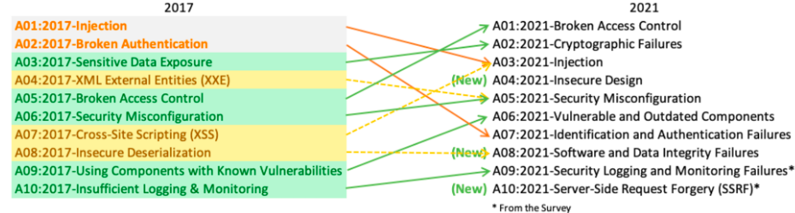

- **A01:2021-Broken Access Control**

> Naik dari posisi kelima; 34 CWE (Common Weakness Enumeration) yang
> dipetakan ke Broken Access Control memiliki lebih banyak kemunculan
> dalam aplikasi dariapda kategori lainnya. Broken Access Control
> memungkinkan entri yang tidak sah yang dapat mengakibatkan kerentanan
> data dan file yang bersifat sensitif. Kontrol akses yang lemah terkait
> manajemen kredensial dapat diatasi dengan metode coding yang unik dan
> beberapa tindakan khusus seperti mematikan akun admin dan two-factor
> authentication.

- **A02:2021-Cryptographic Failures**

> Naik dari posisi kelima; 34 CWE (Common Weakness Enumeration) yang
> dipetakan ke Broken Access Control memiliki lebih banyak kemunculan
> dalam aplikasi dariapda kategori lainnya. Broken Access Control
> memungkinkan entri yang tidak sah yang dapat mengakibatkan kerentanan
> data dan file yang bersifat sensitif. Kontrol akses yang lemah terkait
> manajemen kredensial dapat diatasi dengan metode coding yang unik dan
> beberapa tindakan khusus seperti mematikan akun admin dan two-factor
> authentication.

- **A03:2021-Injection**

> Turun ke posisi ketiga; Injeksi mungkin terjadi apabila peretas
> memanipulasi kode yang tidak aman kemudian diinjeksikan ke dalam suatu
> program. Seringkali program yang diinjeksikan tidak dapat
> mengidentidikasi data yang terinjeksi. Jadi, peretas dapat mengetahui
> informasi rahasia, karena sistem mengidentifikasi bahwa peretas adalah
> pengguna yang terpercaya

- **A04:2021-Insecure Design**

> Merupakan sebuah kategori baru dengan fokus pada risiko yang terkait
> dengan kekurangan desain. Kategori ini membahas pentingnya penggunaan
> pemodelan ancaman, pola dan desain yang aman, dan arsitektur
> referensi.

- **A05:2021-Security Misconfiguration**

> Merupakan sebuah kategori baru dengan fokus pada risiko yang terkait
> dengan kekurangan desain. Kategori ini membahas pentingnya penggunaan
> pemodelan ancaman, pola dan desain yang aman, dan arsitektur
> referensi.

- **A06:2021-Vulnerable and Outdated Components**

> Naik ke posisi keenam. Sebelumnya dikenal dengan Using Components with
> Known Vulnerabilities. Peretas dapat menyerang dan memanipulasi
> keamanan kode serta API sistem. Serangan ini dilakukan karena komponen
> pihak ketiga dan ketergantungan yang tidak aman.

- **A07:2021-Identification and Authentication Failures**

> Turun dari posisi kedua. Sebelumnya dikenal dengan Broken
> Authentication dan sekarang termasuk CWE yang lebih terkait dengan
> kegagalan identifikasi. Risiko yang signifikan dapat memungkinkan
> peretas untuk menyalin peran dari identitas pengguna yang sah.
> Penggunaan alat pemindai DAST dan SCA dapat mendeteksi dan mengatasi
> permasalahan yang mencakup kesalahan implementasi sebelum programmer
> mengaplikasikan kode.

- **A08:2021-Software and Data Integrity Failures**

> Merupakan sebuah kategori baru pada tahun 2021. Kategori ini berfokus
> pada keputusan terkait pembaruan perangkat lunak, data penting, dan
> pipeline CI/CD tanpa memverifikasi integritas. Kategori ini merupakan
> salah satu dampak dari CVE (Common Vulnerability and Exposures) dan
> CVSS (Common Vulnerability Scoring System).

- **A09:2021-Security Logging and Monitoring Failures**

> Naik ke posisi kesembilan. Kategori ini diperluas untuk mencakup lebih
> banyak jenis kegagalan. Peretas bergantung pada kurangnya pemantauan
> dan pemulihan yang lambat untuk melakukan penyerangan. Aktivitas login
> tanpa kegagalan, kontrol akses dan validasi data dari server dapat
> mengidentifikasi aktivitas yang mencurigakan dalam sistem

- **A10:2021-Server-Side Request Forgery**

> Merupakan kategori baru dan berfokus pada pengujian. SSRF berkaitan
> dengan cakupan pengujian di atas rata-rata terhadap potensi
> eksploitasi dan dampak. Pada kategori ini, skenario pada tim keamanan
> juga menuntut relevansi data.

**OWASP TOP 10 DENGAN JUICE SHOP**

OWASP juice shop adalah aplikasi vulnerable website yang dikelola oleh
OWASP. Aplikasi ini digunakan sebagai media pembelajaran terhadap
kerentanan OWASP Top 10. OWASP Juice Shop dibuat dengan Node.js,
Express, dan Angular. Aplikasi Juice Shop merupakan aplikasi website
yang mencakup sejumlah besar kerentanan dari OWASP Top 10 di mana
pengguna dapat meretas kerentanan tersebut. Progres peretasan yang
dilakukan dapat dilihat melalui score board.

Berikut adalah halaman score board yang juga salah satu challenge pada
aplikasi Juice Shop

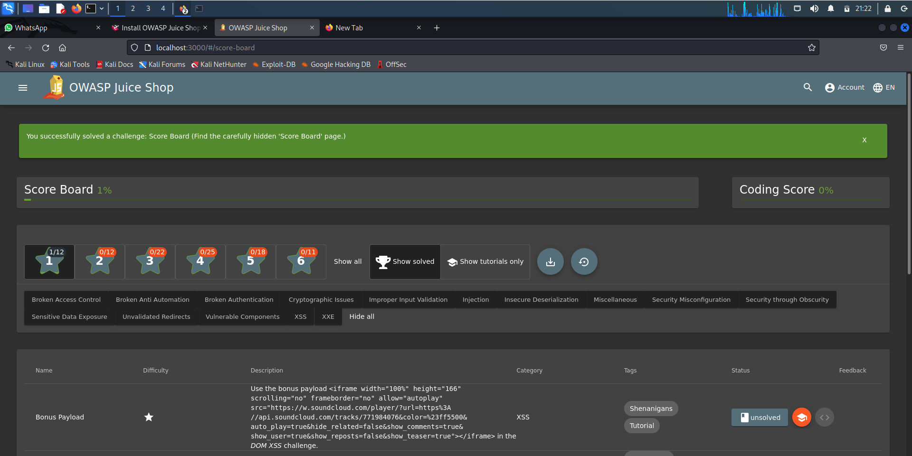

OWASP Juice Shop merupakan sebuah aplikasi website yang diimplementasi
melalui JavaScript dan TypeScript. Pada bagian frontend digunakan
framework Angular untuk membuat Single Page Application. Pada bagian
layout user interface digunakan Material Design menggunakan komponen
Angular Material.

Bahasa pemrograman JavaScript juga digunakan pada bagian backend melalui
Express yang dihosting di server Node.js untuk mengirimkan kode
client-side ke browser. Express juga berperan dalam pembuatan fungsi
backend melalui RESTful API. SQLite dipilih sebagai database karena
SQLite merupakan database yang ringan karena berbasis file. Sebagai
penyimpanan tambahan, MarsDB juga ditambahkan karena banyak digunakan
dan kompatibel dengan Sebagian besar operasi query.

Notifikasi push juga dapat terlihat saat challenge berhasil dilakukan
yang mana hal ini diimplementasikan melalui WebSocket Protocol. Aplikasi
tersebut juga memiliki fitur registrasi pengguna melalui OAuth 2.0 yang
memungkinkan pengguna dapat menggunakan akun Google.

Instalasi OWASP Juice Shop

1\. download OWASP juice shop

Tahapan

- Membuka VM Virtual box

- Jalankan OS linux yang sudah anda install (gunakan kali linux)

- Buka terminal kali dengan mode super user(root)

- Download file owasp dengan mengetikkan perintah berikut

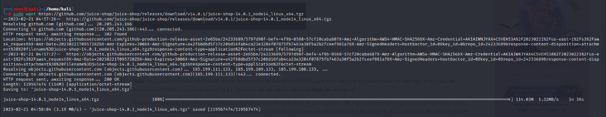

- Setelah di download ekstrak file owasp dengan mengetikkan perintah
  berikut

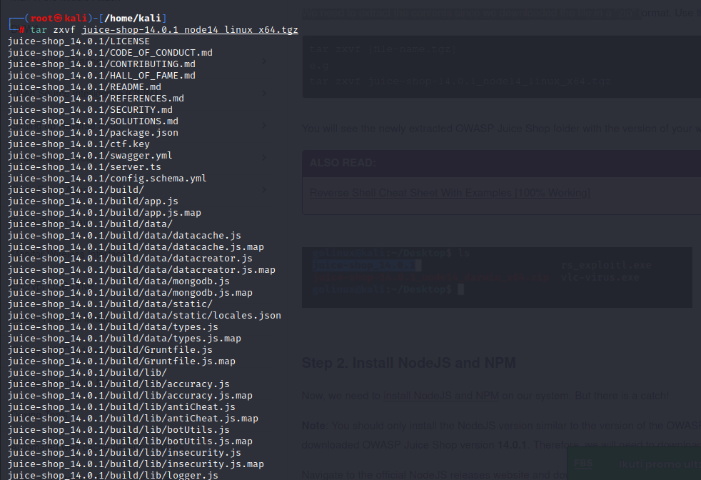

- Lakukan pengecekan direktori dengan menggunakan perintah ls

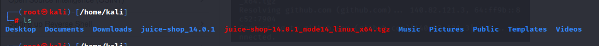

2\. Install Node.js npm

- download node.js dan npm

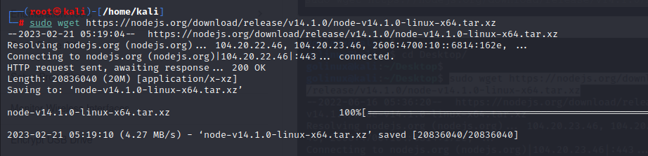

- ekstrak node.js

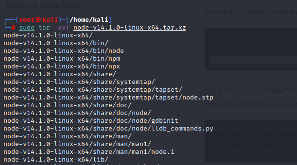

- setelah di ekstrak pindahkan file ke folder dibawah ini

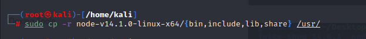

- lakukan pengecekan versi ke node.js dan npm untuk memastikan bahwa
  node.js dan npm terinstal

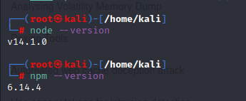

3\. install node dependencies

- masuk ke direktori owasp juice shop dan lakukan install npm

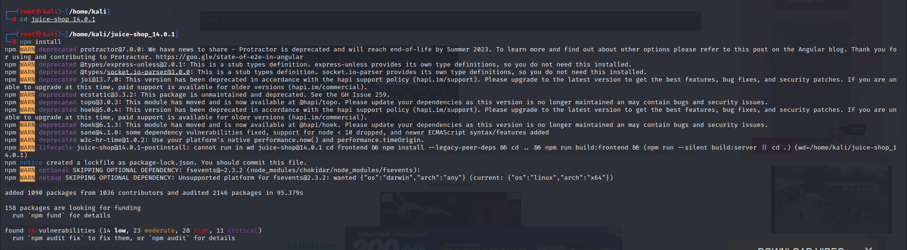

- jalankan dengan npm start

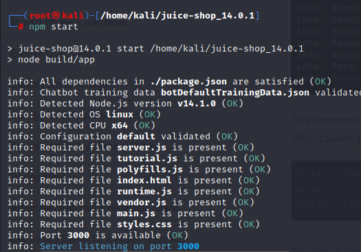

- jalankan owasp di website dengan mengetikan URL
  <http://localhost:3000/>

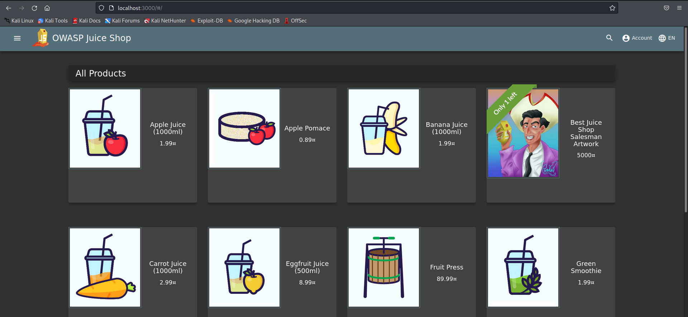
