**PRAKTIKUM KEAMANAN JARINGAN**

**“Attack Scenario”**

**Oleh :**

**Andre Septian Prayogo**

**D4 LJ Teknik Informatika B**

**3122640033**

**POLITEKNIK ELEKTRONIKA NEGERI SURABAYA**

**TAHUN AJARAN**

**2023**

Pada percobaan kali ini, kita mencoba melakukan peretasan terhadap
sebuah virtual box image dengan OS Ubungu. Goal kali ini adalah kita
berhasil mengakses database dan mendapat user rootnya, untuk dapat
mengakses database kita akan menggunakan SQLmap dan untuk mendapatkan
akses user root kita akan menggunakan Nmap.

SQLmap merupakan alat (tool) bantu open source dalam melakukan tes
penetrasi yang mengotomasi proses deteksi dan eksploitasi kelemahan SQL
injection dan pengambil-alihan server basis data. SQLmap dilengkapi
dengan pendeteksi canggih, fitur-fitur handal bagi penetration tester,
beragam cara untuk mendeteksi basis data, hingga mengakses file system
dan mengeksekusi perintah dalam sistem operasi melalui koneksi
out-of-band

NMAP adalah singkatan dari Network Mapper yang merupakan sebuah tool
atau alat yang bersifat open source. Alat ini hanya digunakan secara
khusus untuk eksplorasi jaringan serta melakukan audit terhadap keamanan
dari jaringan.

Brute force adalah upaya mendapatkan akses sebuah akun dengan menebak
username dan password yang digunakan. Brute force attack sebenarnya
merupakan teknik lama dalam aksi cyber crime. Namun, ternyata masih
banyak digunakan karena dianggap masih efektif. Namun itu hanya langkah
awal metode serangan. Tujuan utama brute force adalah mengakses situs,
server yang menyimpan berbagai informasi dan aset penting lain. Setelah
masuk ke dalam sistem, hacker dapat mengendalikan website Anda hingga
mencuri data.

## **A. Mendapatkan user root**

1\. Langkah pertama kita akan mengecek IP dari device yang kita gunakan
dengan ifconfig

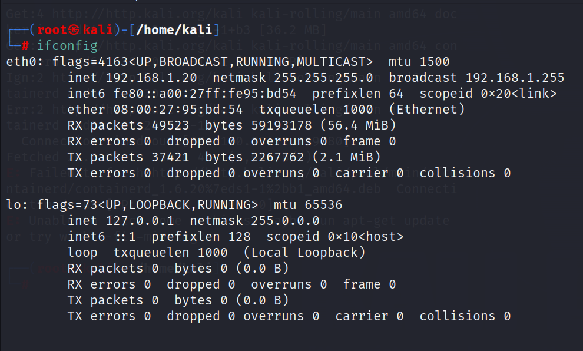

2\. selanjutnya kita akan menggunakan ipclac “IP kita” untuk mengetahui
informasi yang lebih rinci tentang ip yang kita gunakan

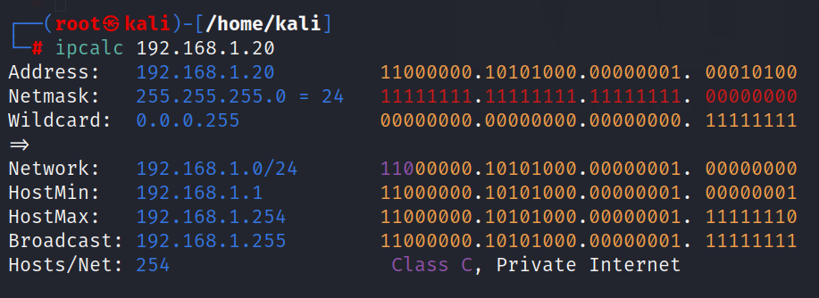

3\. kita akan melakukan scan menggunakan nmap -sT “network kita”

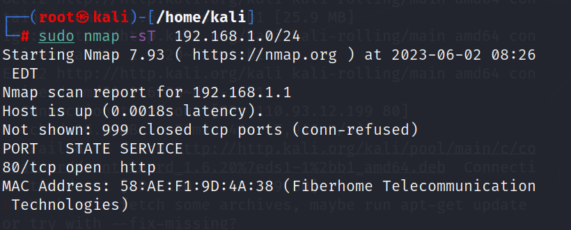

Dalam command di atas -sT di artikan kita akan mengcek semua yang ada di
network kita, semua port yang terbuka missal port SSH http dan yang lain

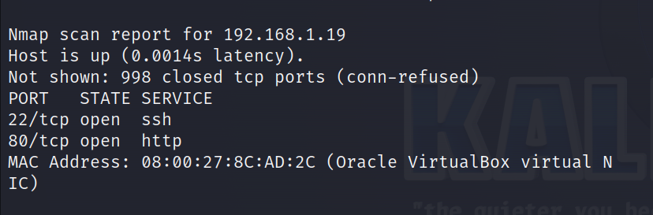

Dan di atas adalah informasi dari virtual box yang akan kita serang,
akan saya sederhanakan commandnya agar spesifik ke ip 19

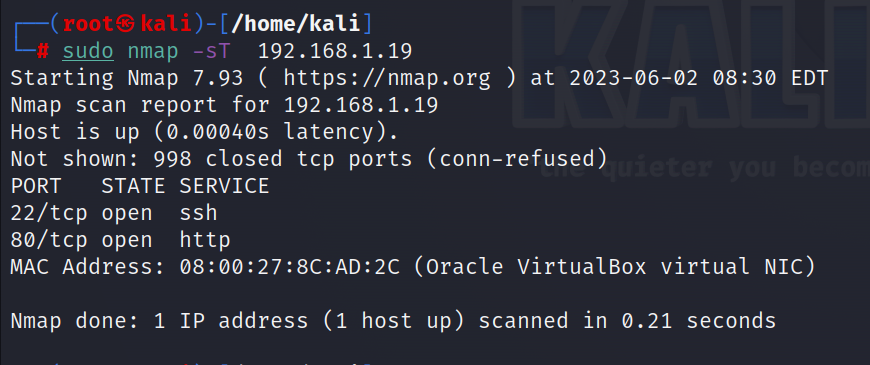

Terlihat port yang terbuka adalah 2 port yaitu port http dan ssh.

4\. setelah kita mendapatkan IP target selanjutnya kita akan menyiapkan
bahan untuk melakukan penyerangan, yaitu list dari username dan juga
password

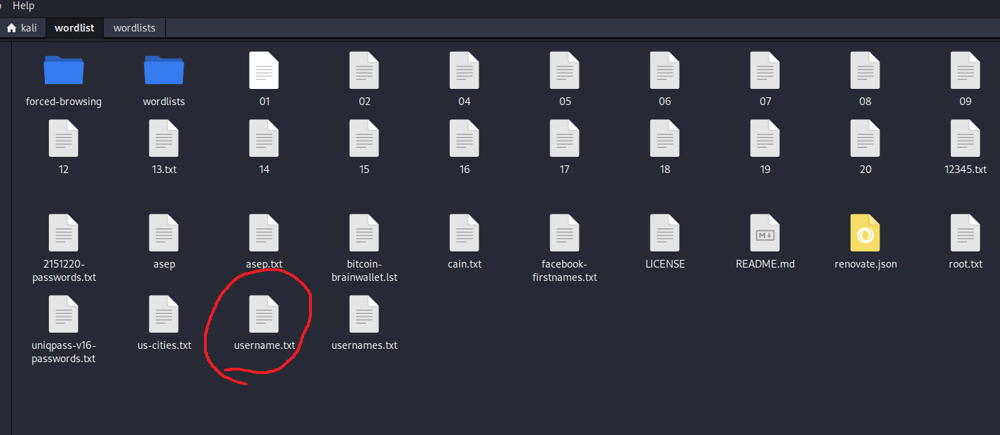

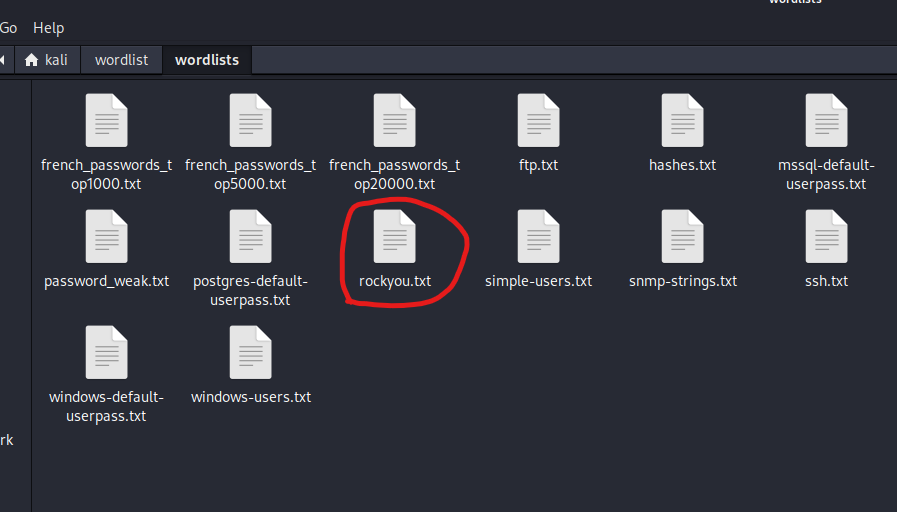

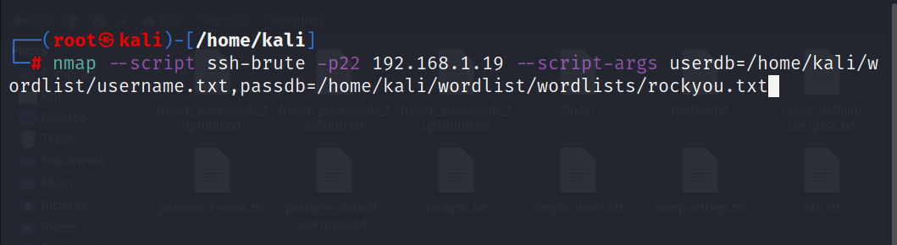

Kita akan menggunakan bruteforce yang menuju ke SSH, -p22 menjelaskan
tujuan penyerangan kita akan dilakukan di port 22 dimana port tersebut
adalah port SSH.

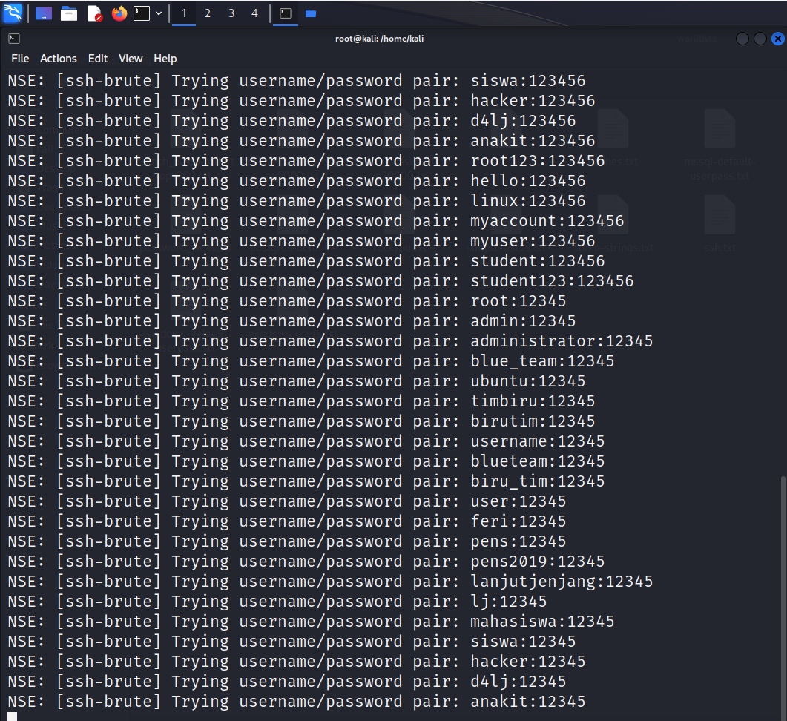

Sayangnya pada step ini tidak ditemukan hasil dari username password
yang valid, dan juga sudah mencoba berbagai wordlist namun hasilnya
tetap sama.

## **B. Mengakses Database**

1\. Langkah pertama yang saya lakukan untuk mendapatkan akses database
adalah melakukan crawling untuk mendapatkan sitemap website yang akan
kita serang menggunakan skipfish

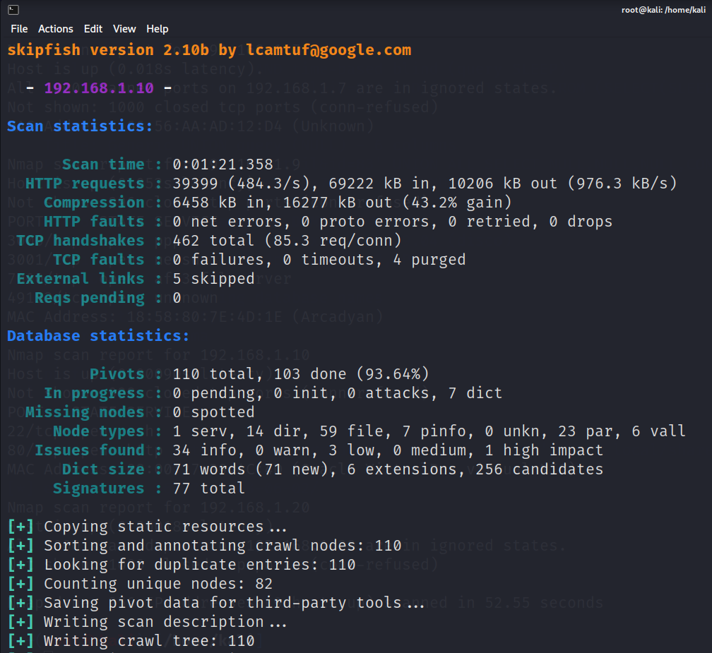

Dan kita bisa melihat hasil dari skipfish dengan membuka direktori dari
skipfish

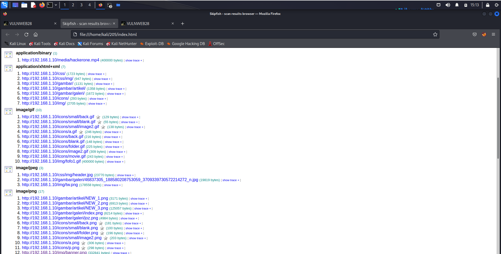

3\. masukkan ip dari server ubuntu ke web

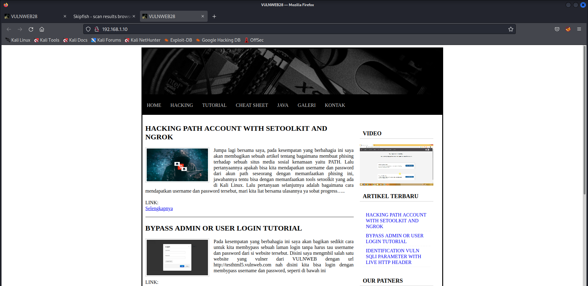

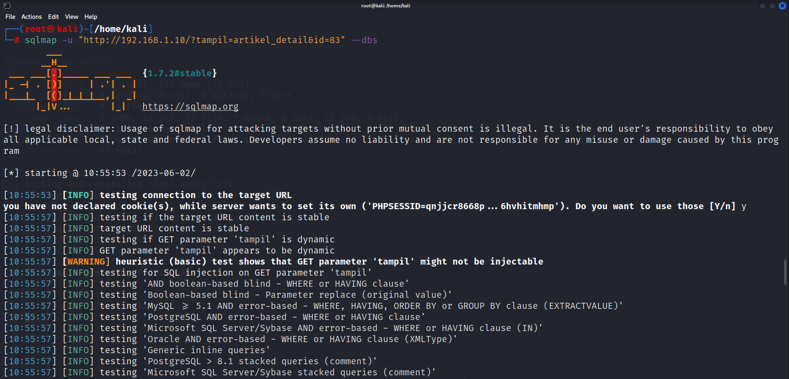

5\. setelah itu pilih vunlweb

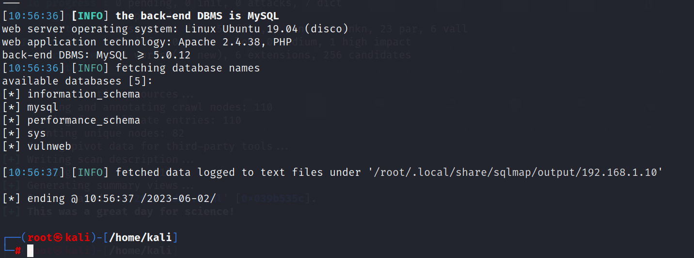

Lakukan pemanggilan database sqlmap -u
"http://192.168.1.10/?tampil=artikel_detail&id=83" -D idvulnewb --tables

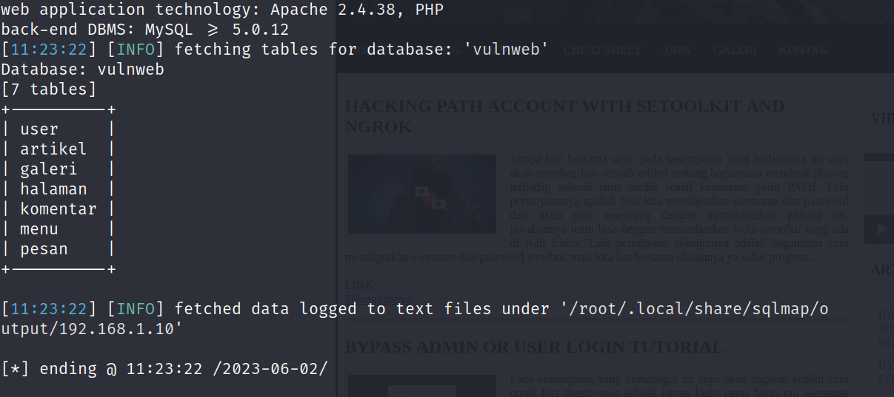

Lakukan command berikut untuk mengambil data user sqlmap -u
"http://192.168.1.10/?tampil=artikel_detail&id=83" -C
id_user,password,username --dump

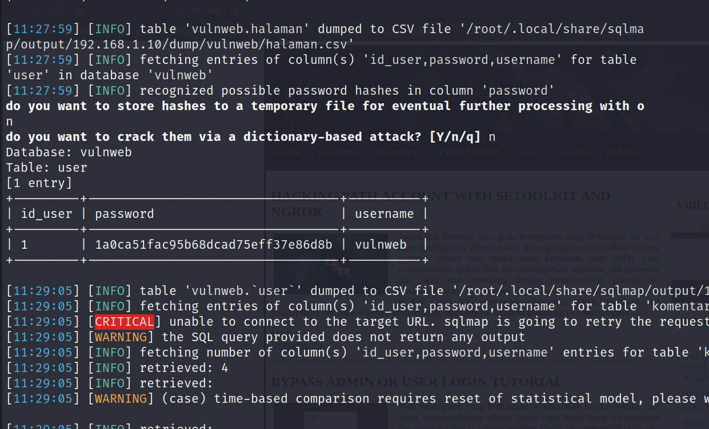

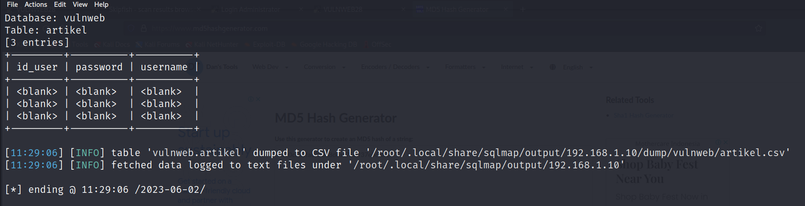

File sudah ada di ditektori tersebut

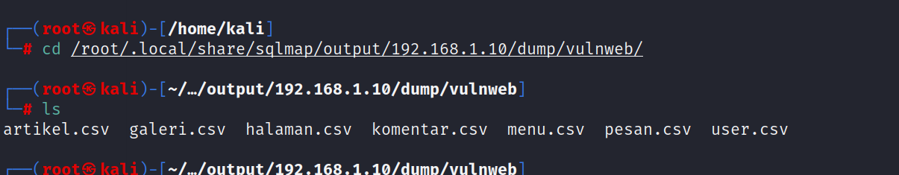

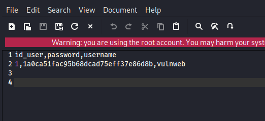
