**PRAKTIKUM KEAMANAN JARINGAN**

**“DataMining”**

**Oleh :**

**Andre Septian Prayogo**

**D4 LJ Teknik Informatika B**

**3122640033**

**POLITEKNIK ELEKTRONIKA NEGERI SURABAYA**

**TAHUN AJARAN**

**2023**

DATA MINING USING KNIME

1\. Bagi File menjadi 5 bagian : init.pcap, init2.pcap, init3.pcap,
init4.pcap, init5.pcap

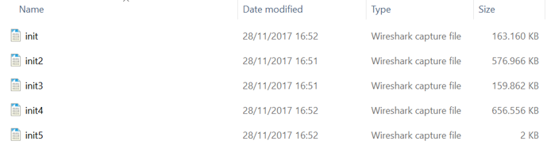

2\. Kemudian buka file tersebut secara bergantian menggunakan Wireshark.
Pada langkah ini kita gunakan file init.pcap

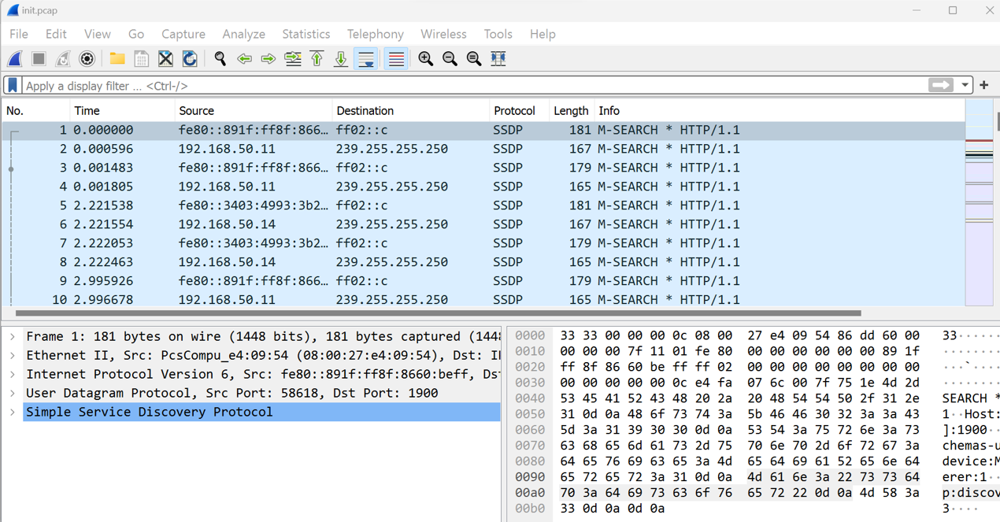

3\. Untuk proses analisis yang akan dilakukan nantinya, kita akan
mengambil data dengan ip versi 4 (ipv4) dan protocol TCP, DNS saja.
Untuk proses tersebut dapat dilakukan pada wireshark menggunakan
perintah ip.version==4 && tcp \|\| dns pada kolom display filter tepat
dibawah toolbar

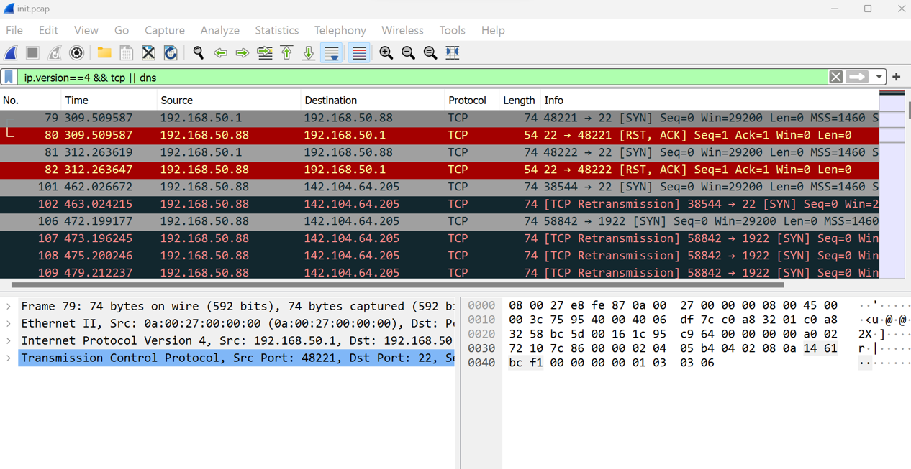

4\. Untuk mendapatkan delta time dan delta time dan delta time display,
klik Edit – Preferences – Column

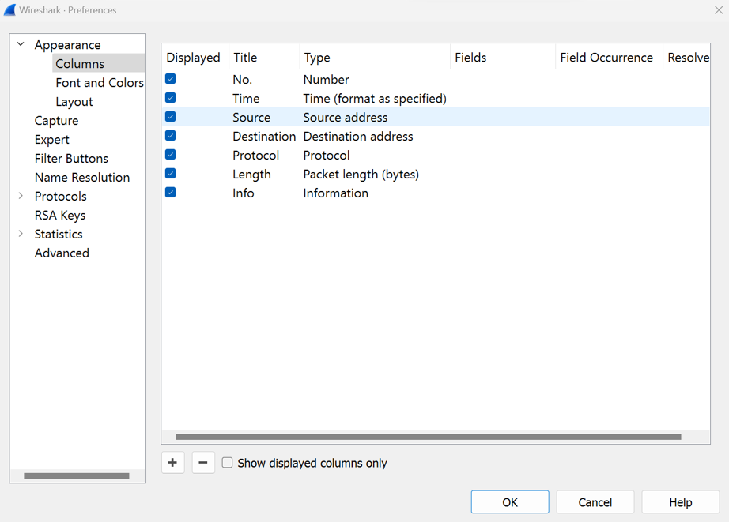

Hasilnya

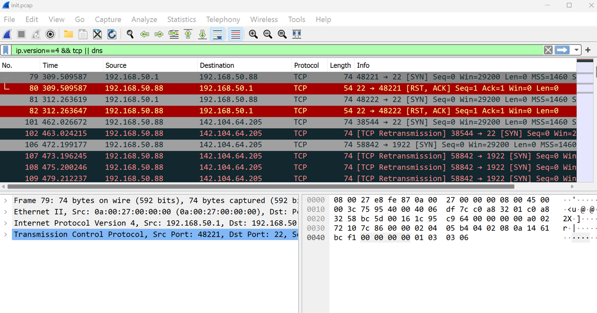

5\. Export file pcap tersebut keformat Comma-separated Value (.csv)
dengan cara klik File – Export Packet Dissections – As CSV. Yang perlu
diperhatikan yaitu pada Pacet Range, pastikan yang terpilih yaitu
Displayed, karena data pada Displayed ini sudah terfilter denga nip
version 4

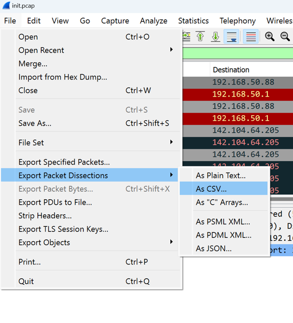

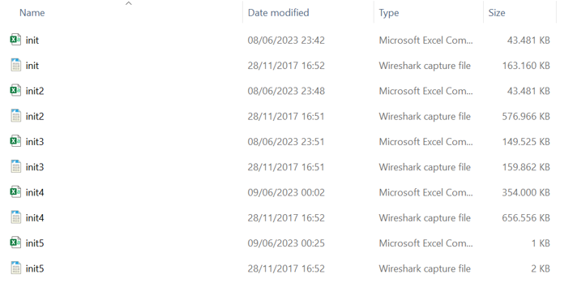

6\. Membuat workflow/project baru. Dengan cara klik File – New – New
Knime Workflow – Tulis Nama workflow dan Lokasi workflow tersebut – Klik
Finish

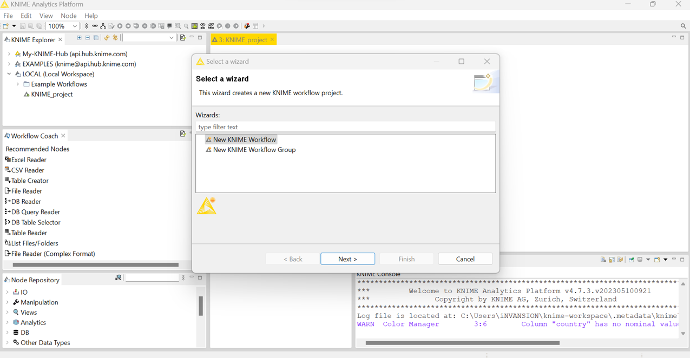

**7.** Tambahkan data ke dalam file reader

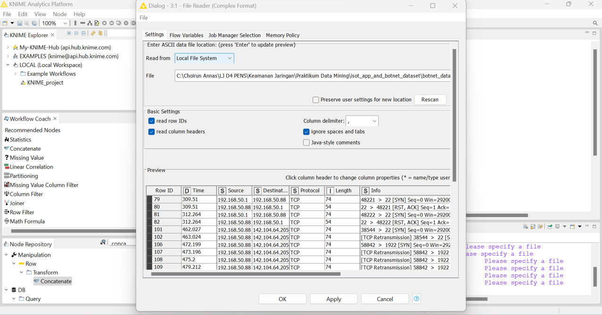

8\. Gabungkan kelima data dengan menggunakan concatenate dan data reader
seperti gambar di bawah

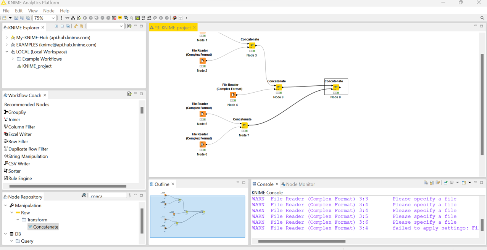

9\. Untuk melakukan labeling data normal kita akan menggunakan Node
Missing Value. Node ini digunakan untuk mengisi data kosong

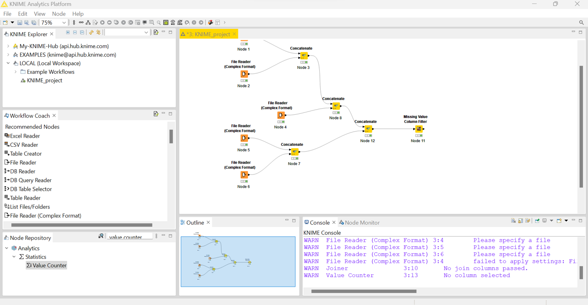

10\. Untuk memastikan bahwa kolom label sudah terisi dengan value
Malicious atau Normal, dapat menggunakan node Value Counter. Node ini
berfungsi untuk menghitung jumlah seluruh value pada kolom terpilih.

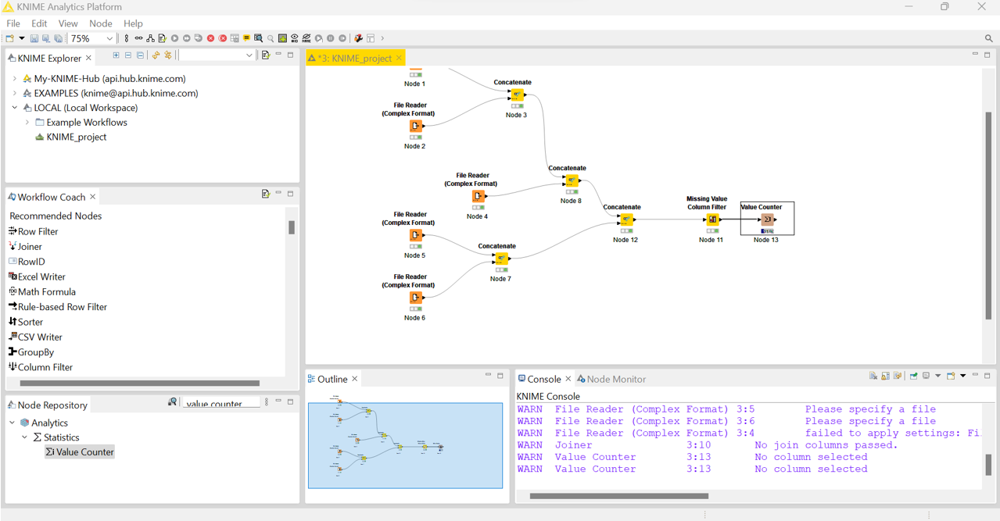

11\. Export file ke dalam format .csv dengan menggunakan node CSV Writer

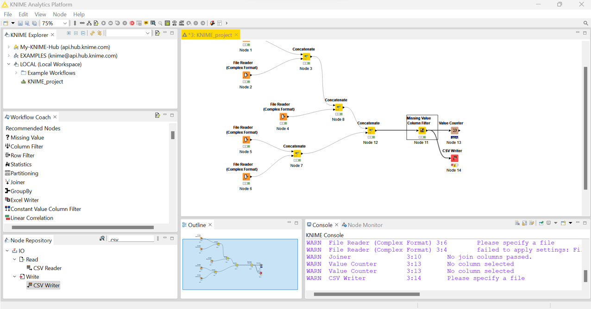

Data diletakkan di dalam file hasil.csv

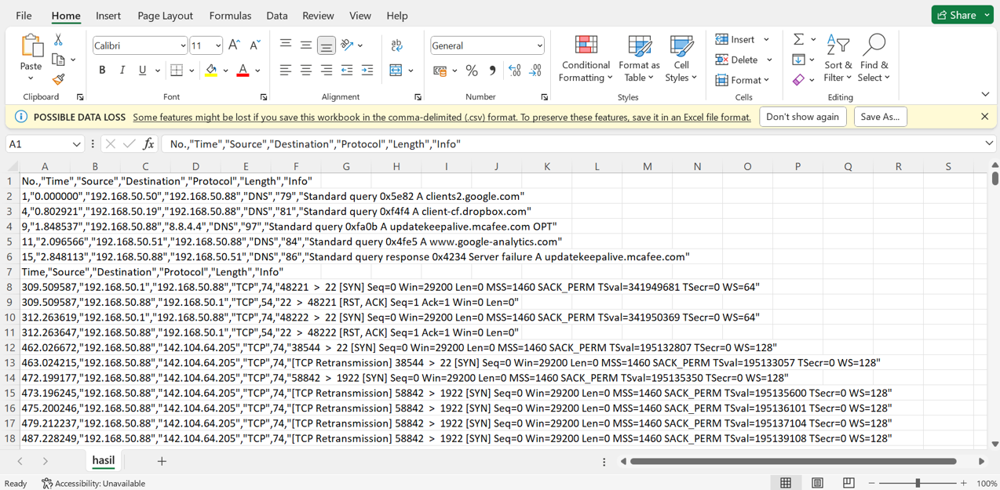

12\. **Data pre-processing**

Proses dimana data akan dibersihkan (cleaning) karena biasanya didalam
suatu data terdapat nilai-nilai yang tidak sempurna atau bahkan terdapat
nilai-nilai yang hilang atau kosong yang nantinya akan dapat
mempengaruhi proses kedepannya. Pada proses ini kita membutuhkan
Node-node berikut : File Reader, Column Filter, Missing Value.

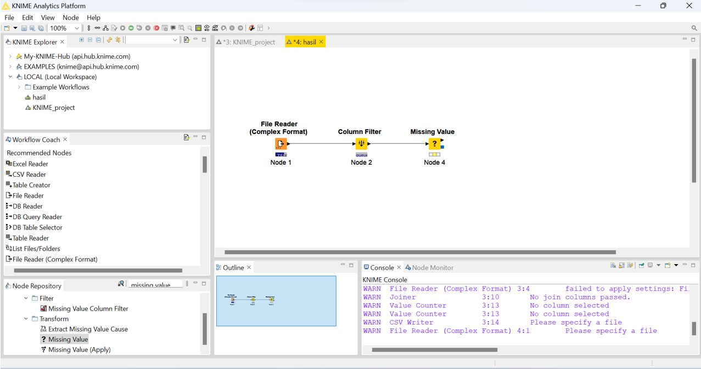

13\. Proses data transformation, pada proses ini data akan diubah ke
format yang sesuai untuk proses data mining. Node yang digunakan pada
tahap ini yaitu Normalizer. Berikut konfigurasinya:

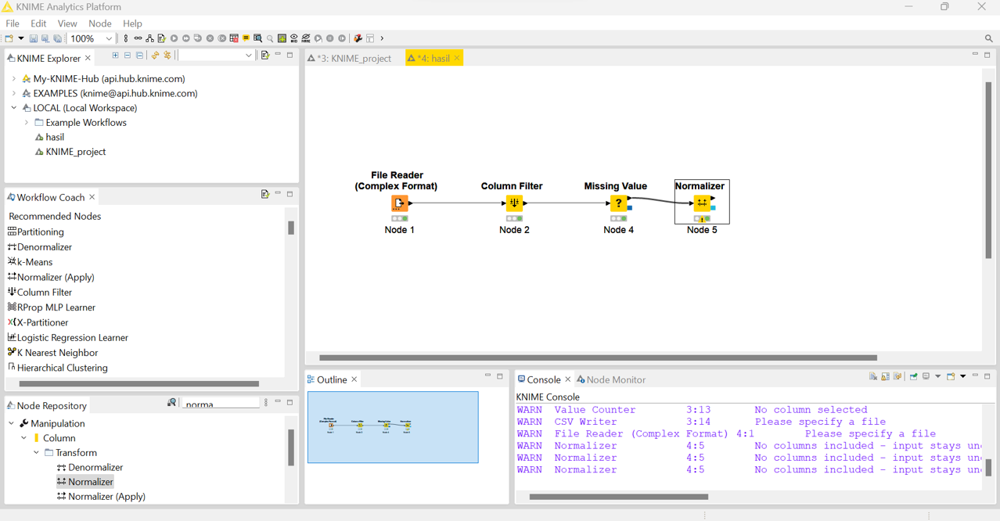

14\. **Data Mining**

Setelah menyelesaikan tahap data transformation, kita akan menjalankan
proses Data Mining, dalam proses ini kita akan menggunakan Metode
Klasifikasi Decision Tree dengan teknik Cross Validation. Pada proses
ini kita membutuhkan Node-node berikut : X-Partitioner, Decision Tree
Learner, Decision Tree Predictor, X-Aggregator Sehingga akan membentuk
flow seperti ini

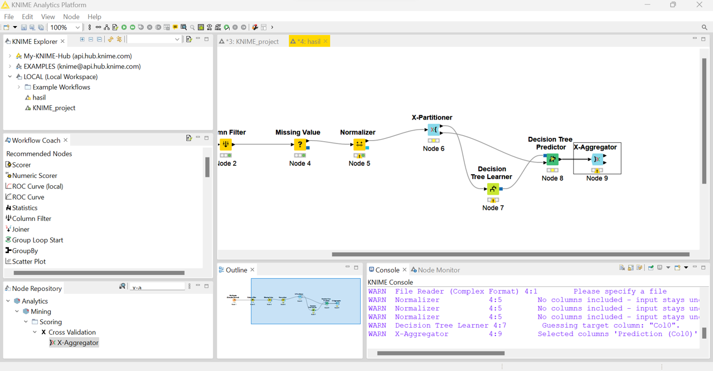

15\. Node Scorer yang didalamnya terdapat perhitungan untuk melihat
seberapa baik model ini dengan menggunakan teknik confusion matrix.
Berikut konfigurasinya.

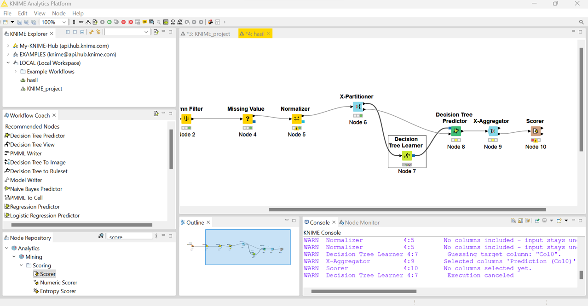

16\. Hasil prediksi

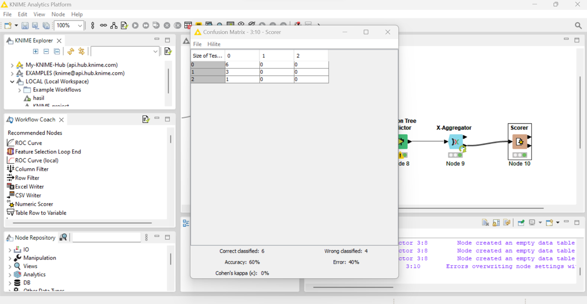
