**PRAKTIKUM KEAMANAN JARINGAN**

**“Cryptographic Failures”**

**Oleh :**

**Andre Septian Prayogo**

**D4 LJ Teknik Informatika B**

**3122640033**

**POLITEKNIK ELEKTRONIKA NEGERI SURABAYA**

**TAHUN AJARAN**

**2023**

Kegagalan kriptografi adalah kerentanan keamanan aplikasi web kritis
yang memaparkan data aplikasi sensitive pada algoritma kriptografi yang
lebah atau tidak ada. Itu bisa berupa kata sandi, catatan
kesehatanpasien, rahasia bisnis, informasi kartu kredit dan informasi
pribadi lainnya.

Aplikasi web modern memproses data saat diam dan transit, yang memrlukan
control keamanan yang ektat untuk mitigasi ancaman yang komperhensif.
Berberapa penerapan menggunakan Teknik kroptografi lebah yang dapat
dipecahkan dalam jangka waktu yang wajar. Bahkan dengan penerapan tekink
kroptografi yang sempurna, pengguna dapat menghindari penerapan praktif
terbaik pelindungan data, yang selanjutnya membuat informasi sensitive
rentan terhadap pencurian data sensitive.

Berikut macam macam cryptographic failures yang berhasil ditemukan pada
website OWASP juice shop.

**Nested Easter Egg**

Easter Egg merupakan pesan tersembunyi yang telah disisipkan kedalam
website

Berikut adalah caranya:

1\. Pergi ke halaman github yang ada pada bagian sidebar menu website
OWASP juice Shop

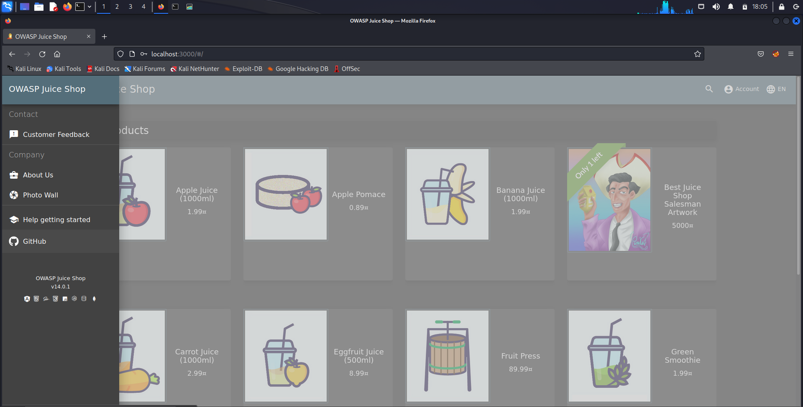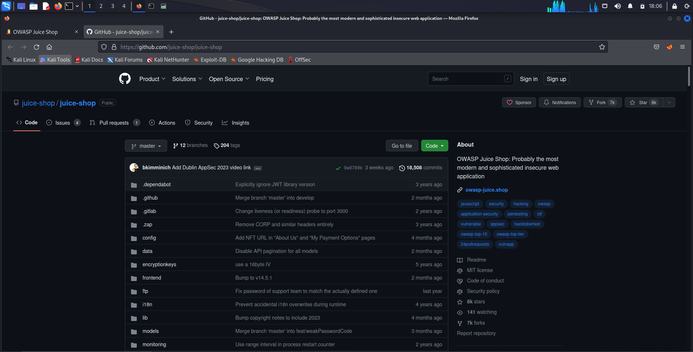

2\. selanjutnya pergi ke folder <http://ftp/eastere.gg> maka akan
melihat kode seperti pada gambar dibawah ini

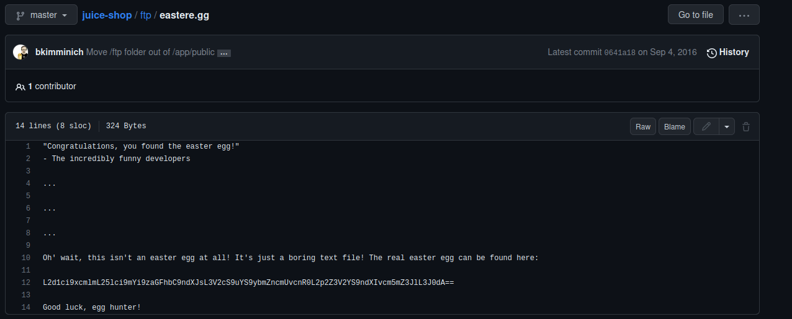

3\. selanjutnya buka website CyberChef

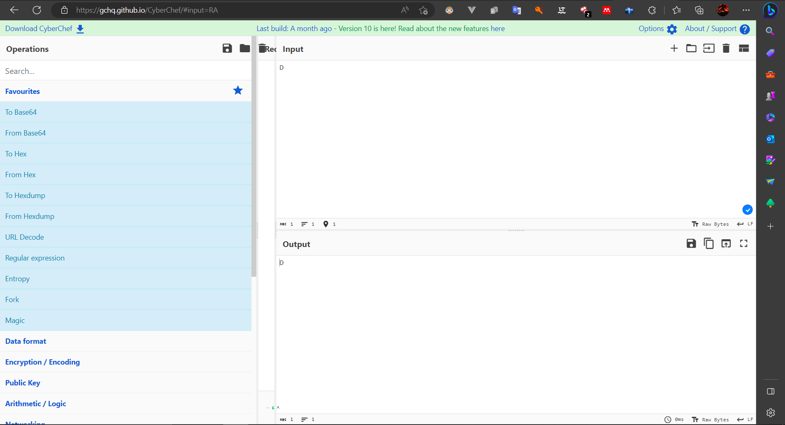

4\. masukkan operasi “Form Base 64” dan ROT 13

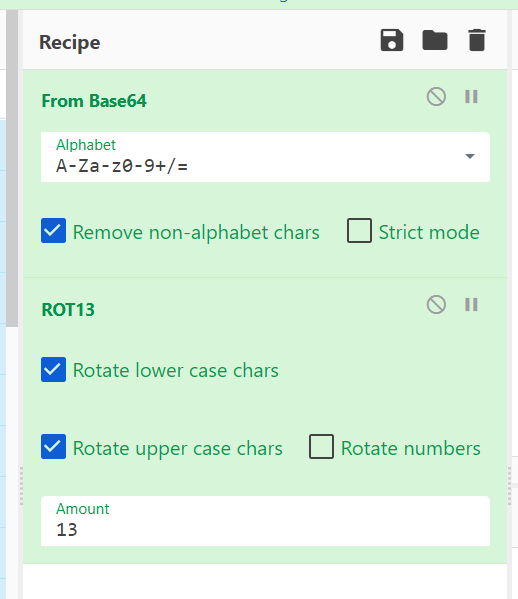

5\. masukkan kode yang kita dapatkan dari github tadi pada input yang
nantinya kita mendapat string seperti URL website

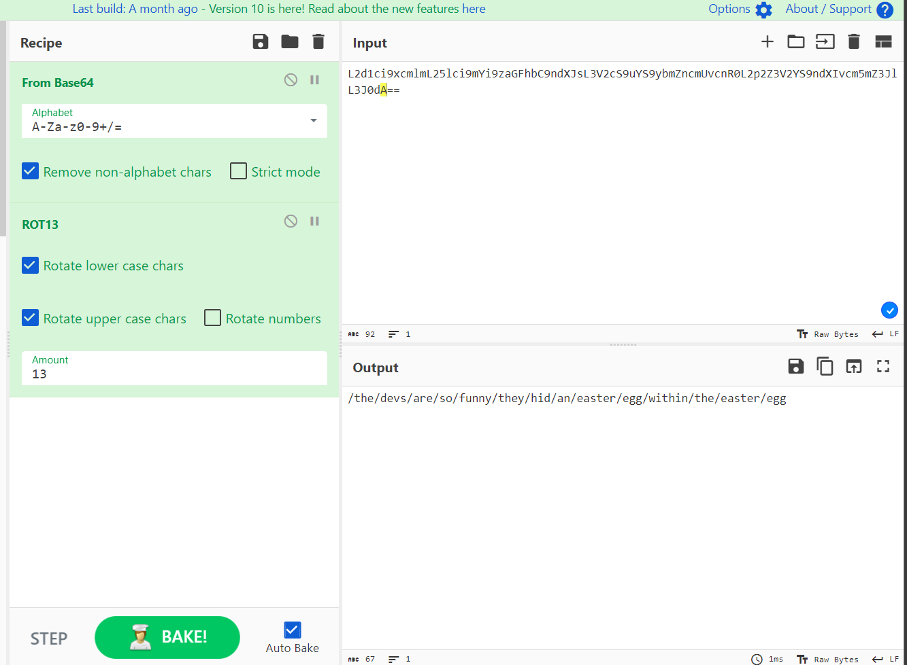

6\. kita coba masukkan URL tersebut ke web OWASP juice shop kita, maka
akan memunculkan halaman website seperti pada gambar dibawah ini

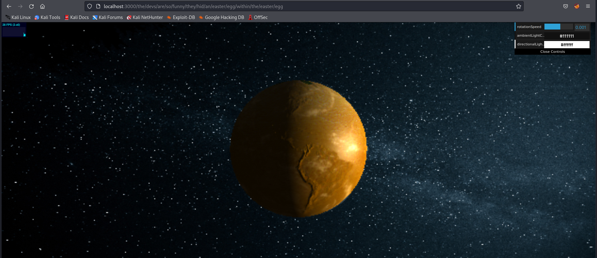

**B. Wired Crypto**

Memberi tahu took tentang algoritma atau library enkripsi yang
seharusnya tidak digunakan

1\. pada Web OWASP, pergi ke halaman customer feedback yang berada di
sidebar menu

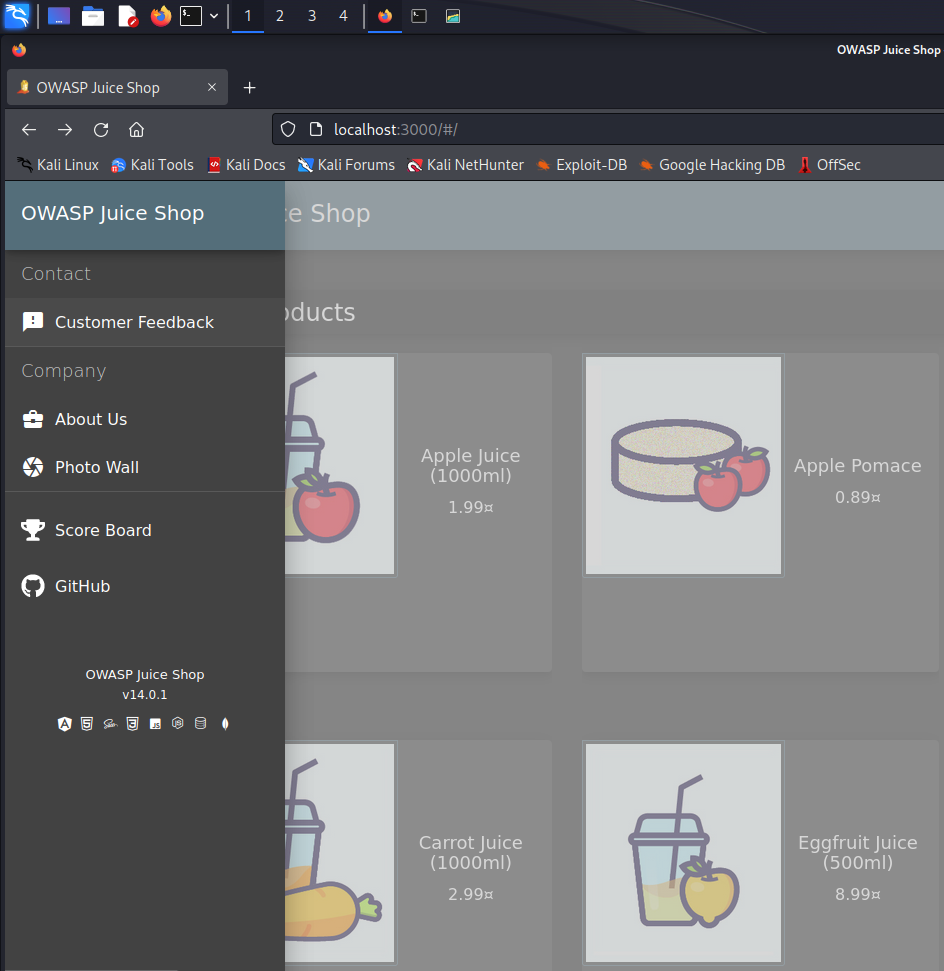

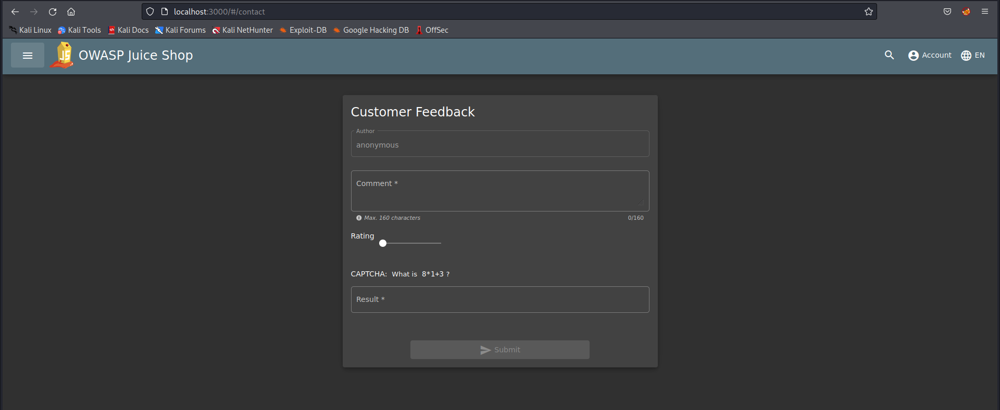

2\. masukkan comment dengan imputan “MD5” lalu submit jawaban. Maka
setelah itu akan mencul notifikasi menyelesaikan challenge wired crypto.

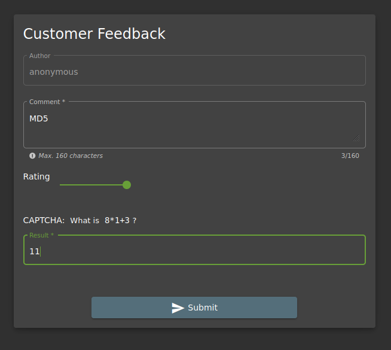

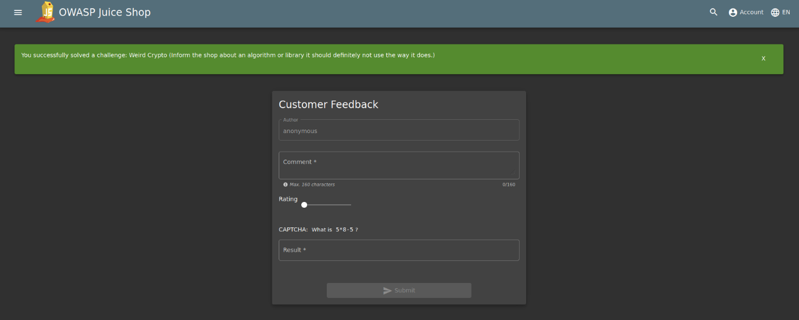

Pesan yang ingin disampaikan dari challenge Wired Crypto ini adalah kita
sudah harus tau algoritma atau library enkripsi apa yang sebaiknya kita
gunakan dan yang sudah harus kita tinggalkan. Salah satu kontoh
algoritma yang sebaiknya sudah ditinggalkan adalah MD5.

MD5 adalah versi lama dari algoritma kriptografi, dimana kata kunci
masih bisa menggunakan 4 huruf. Didesain oleh Ronald Rivest pada 1991.
Lima tahun kemudian pada 1996 ditentukan cacat dalam desainnya sehingga
mulai ditinggalkan dan digantikan dengan alogoritma baru seperti SHA-1
dan SHA-2. Saat ini, di pasaran juga tersedia aplikasi untuk membuka
enkripsi MD5 yang disebut “MD5 Hash Generator”. Secara teori enkripsi
MD5 memang kurang aman disbanding SHA2 sebab hanya memiliki Panjang 128
bit.
