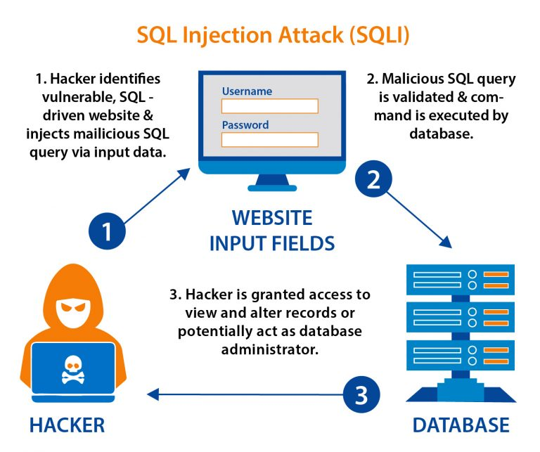
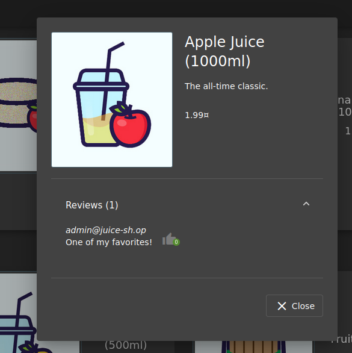
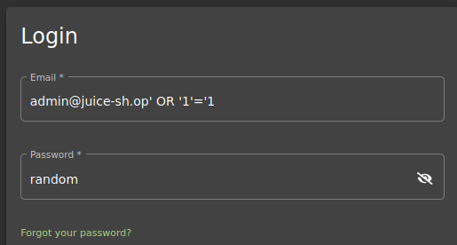
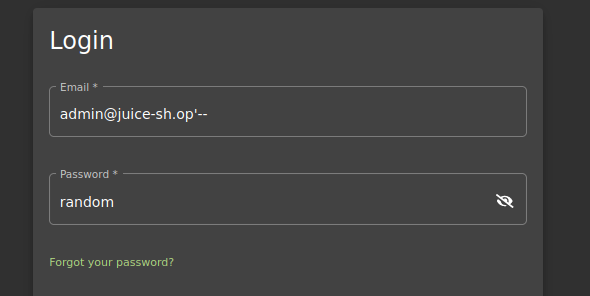
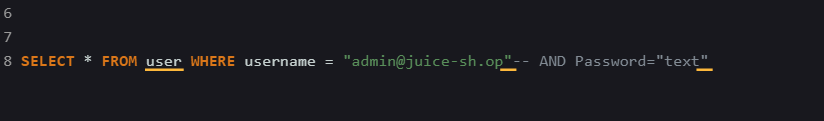
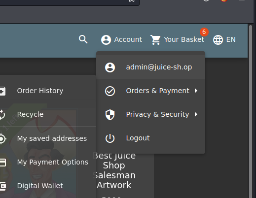
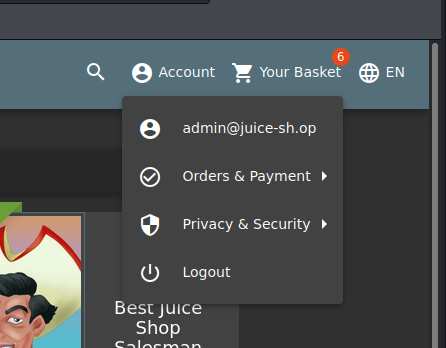

**PRAKTIKUM KEAMANAN JARINGAN**

**“SQL Injection”**

**Oleh :**

**Andre Septian Prayogo**

**D4 LJ Teknik Informatika B**

**3122640033**

**POLITEKNIK ELEKTRONIKA NEGERI SURABAYA**

**TAHUN AJARAN**

**2023**

Injection

OWASP Top Ten adalah daftar risiko keamanan aplikasi web paling kritis
yang diidentifikasi Oleh Open Web Application Security Project (OWASP).
Kerentanan injeksi terdaftar sebagai salah satu dari I O risiko keamanan
teratas dalam aplikasi web.

Serangan injeksi terjadi ketika input pengguna yang tidak dipercaya
tidak divalidasi atau dibersihkan dengan benar, memungkinkan kode
berbahaya disuntikkan ke dalam database aplikasi atau lingkungan
eksekusi. Hal ini dapat menyebabkan berbagai pelanggaran keamanan yang
serius, seperti akses tidak sah ke data sensitif, manipulasi data, dan
eksekusi kode berbahaya.

Kategori OWASP Top 10 Injection mencakup berbagai jenis serangan
injeksi, seperti injeksi SQL, injeksi LDAP, dan injeksi XML. Injeksi SQL
adalah jenis serangan injeksi yang paling umum dan terkenal, di mana
penyerang menyuntikkan pernyataan SQL berbahaya ke bidang masukan
pengguna, mengeksploitasi kerentanan untuk mengambil, memodifikasi, atau
menghapus data sensitif.

Cara Kerja SQL Injection

**Skenario 1**

Pada umumnya SQL code untuk login adalah sebagai berikut:

SELECT \* FROM user WHERE username = "text" AND Password="text"

Dan pada sesi ini kita telah mengetahui email dari admin yang ada di
juice shop dengan melihat pada foto berikut

Jadi email adminnya adalah <admin@juice-sh.op>, maka dari itu tinggal
kita simulasikan ke SQL line code tadi

SELECT \* FROM user WHERE username = "admin" AND Password="text"

Lalu kita akan memasukkan username yang ada di form login dengan sebagai
berikut

Jika kita menggunakan sql injeksi seperti di atas maka SQL line code
akan berubah menjadi berikut

SELECT \* FROM user WHERE username = "admin@juice-sh.op" OR "1"="1" AND
Password="random"

Apa yang kita lakukan di atas? Kita memasukkan tambahan SQL code di
inputan username yang akan merusak tatanan dari string tersebut.

Untuk cara kerjanya adalah sebagai berikut:

Pertama SQL akan mengecek kode AND dan setelah itu OR, dan untuk
membacanya adalah sebagai berikut:

Apakah username sama dengan <admin@juice-sh.op> AND Password="random",
untuk keluarannya dalah False karena passwordnya salah, setelah itu akan
membaca yang kedua.

Apakah username sama dengan <admin@juice-sh.op> OR "1"="1" . statement
tersebut true karena memang 1 sama dengan 1 jadi perintah akan langsung
di anggap sebagai true.

**Skenario 2**

pada scenario ini kita akan memanfaatkan SQL command yaitu “—” yang
nantinya akan di masukkan ke username seperti berikut

Pada SQL “—” berarti memberi command kepada line code SQL dan secara
otomatis kata setelah tanda command tidak akan di anggap dan akan
langsung di lewati tanpa dibaca oleh sistem, berikut contohnya

Setelah ditambahkan “—” maka AND Password="text" secara otomatis akan di
anggap sebagai command dan sql hanya membaca username saja.

Percobaan 1

Cari tahu email admin dengan melihat rincian item

Masuk ke login dan masukkan kode seperti dibawah ini

Setelah itu klik login

Secara otomatis anda akan login sebagai admin

**Percobaan 2**

Masukkan kode seprti di bawah ini

Tekan login dan anda akan bisa login dengan akun admin

