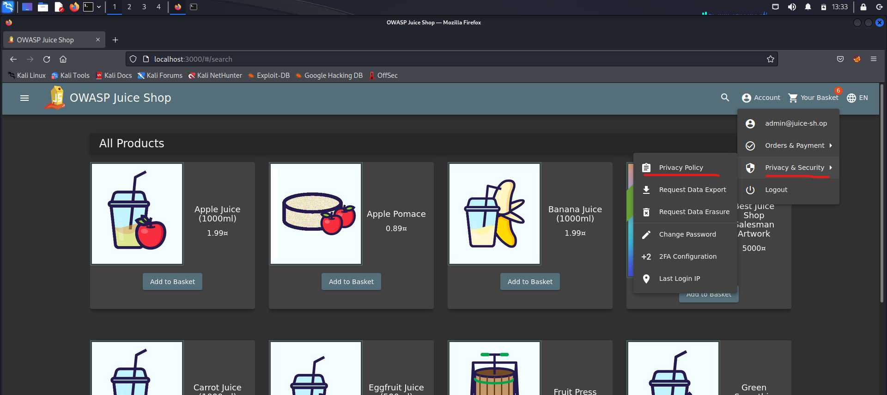
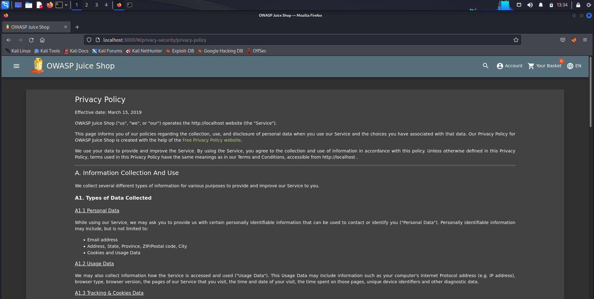
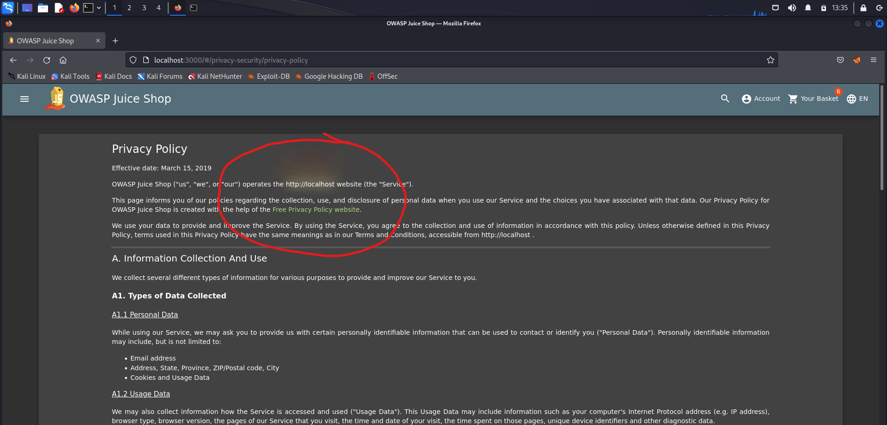
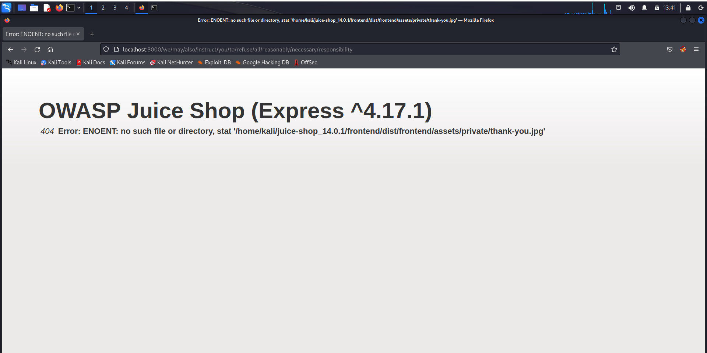

**PRAKTIKUM KEAMANAN JARINGAN**

**“Insecure Design”**

**Oleh :**

**Andre Septian Prayogo**

**D4 LJ Teknik Informatika B**

**3122640033**

**POLITEKNIK ELEKTRONIKA NEGERI SURABAYA**

**TAHUN AJARAN**

**2023**

Insecure design adalah sebuah representasi kategori yang luas dari
banyak kelemahan yang berbeda, yang diekspresikan sebagai “desain
okntrol yang tidak ada atau kurang efisien.”. desain tidak aman bukan
sumber dari semua kategori resiko top 10 yang lain.

Security through obscurity (STO) adalah salah satu challenge yang
termasuk insecure design. STO adalah proses penerapan keamanan dalam
suatu sistem dengan menegakkan kerahasiaan dan kerahasaiaan arsitektur
desain internal sistem. keamanan melalui ketidakjelasan berutjuan untuk
mengamankan istem dengan sengaja menyembunyikan kelemahan keamanannya.

STO didasarkan pada gagasan bahwa sistem informasi apapun selama
kerentanan keamanan tetap tersembunyi, membuat kecil kemungkinan untuk
di eksploitasi oleh hacker. Ketidak jelasan berarti merahasiakan celah
keamanan sistem yang mendasarinya. Biasanya pendekatan hacker dalam
eksploitasi sistem dimulai dengan mengidentifikasi kerentanan. Jika
tidak ada informasi kerentanan, peretas akan merasa sistem lebih sulit
ditembus dan pada akhirnya akan menunda tujuan jahatnya.

**Privacy Policy Inspection**

Pada challenge ini kita diperintahkan untuk melakukan inspeksi pada
halaman privacy policy unutk mendapatkan informasi penting dari web
OWASP Juice Shop.

Masuk ke halaman privacy policy dengan melakukan klik account pada
bagian navbar lalu klik privacy & security dan selanjutnya klik privacy
policy.

Pada halaman ini Ketika kita melakukan hover pada bagian alamat domain
kita, akan muncul warna kuning dan merah seperti pada gambar ini

Ternyata tidak hanya pada alamat diatas, masih ada kalimat kalimat
lainnya Ketika di hover akan muncul warna yang sama. Berikut adalah list
kalimatnya

- <http://127.0.0.1>

- We may also

- Instruct you

- To refuse all

- Reasonably necessary

- Responsibility

Jika kita gabungkan semua kalimat tersebut maka akan menjadi url seperti
berikut ini

<http://127.0.0.1:3000/We/may/also/instruct/you/to/refuse/all/reasonably/necessary/responsibility>
dan akan muncul halaman website seperti gambar berikut

Dari halaman tersebut kita dapat melihat informasi penting seperti
framework yang digunakan beserta dengan versinya, kita juga dapat
melihat struktir directorynya juga. Oleh karena itu challenge ini
termasuk insecure design karena melanggar “CWE-209 Generation of Error
Message Containing Sensitive Information”
