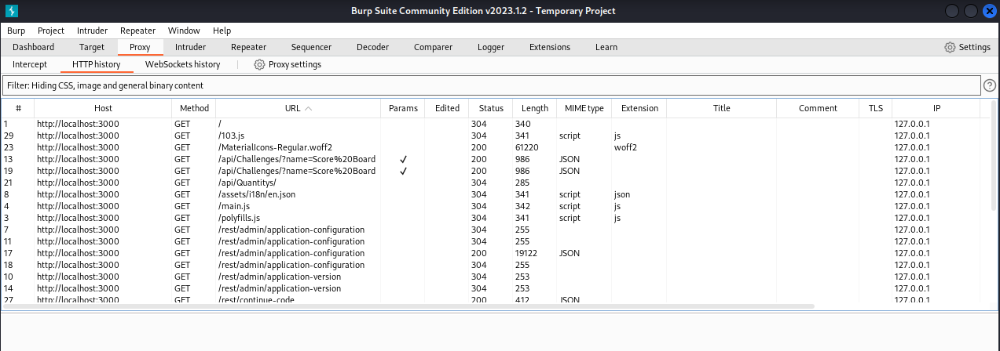
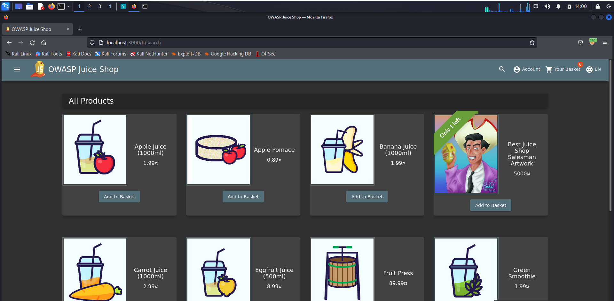
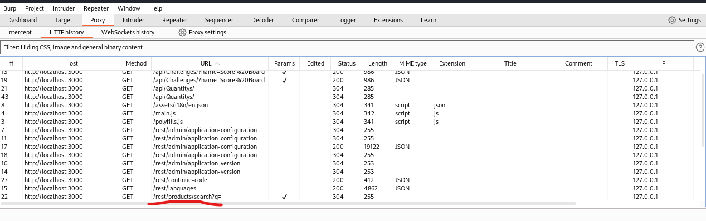
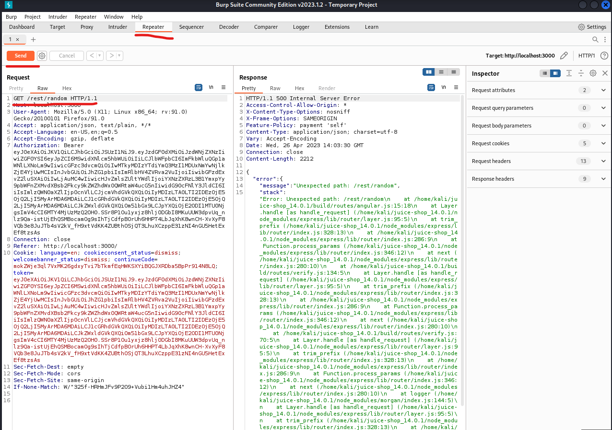

**PRAKTIKUM KEAMANAN JARINGAN**

**“Security Misconfiguration”**

**Oleh :**

**Andre Septian Prayogo**

**D4 LJ Teknik Informatika B**

**3122640033**

**POLITEKNIK ELEKTRONIKA NEGERI SURABAYA**

**TAHUN AJARAN**

**2023**

Security misconfiguration adalah kelemahan yang paling sering terjadi di
antara kelemahan lain di daftar ini. Biasanya kesalahan terjadi jika
hanya menggunakan default configuration tanpa melihat kebutuhan website

**Error Handling**

Memunculkan error, tetapi error yang ditampilkan tidak bagus dan
konsisten

Nyalakan burp suite

Buka browser dan pergi ke halaman utama website owasp juice shop

Buka Kembali burp suite maka akan muncul request baru yaitu
/rest/product/search

Masukkan playload /rest/product/search tadi ke repeater lalu ubah
endpointnya menjadi text random lalu klik send

Maka yang terjadi adalah response error 500 atau internal server error
yang begitu Panjang dan tidak tertata
