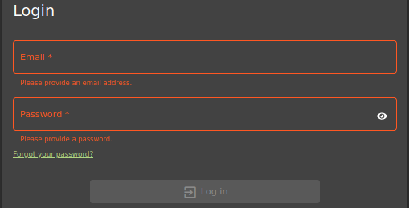
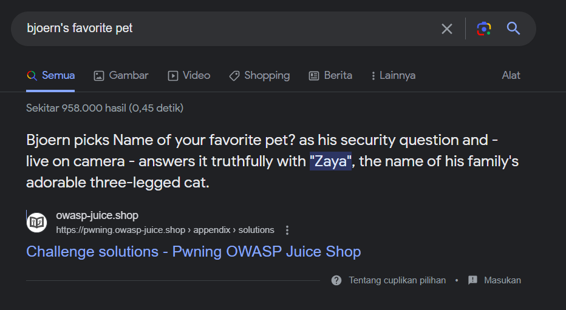
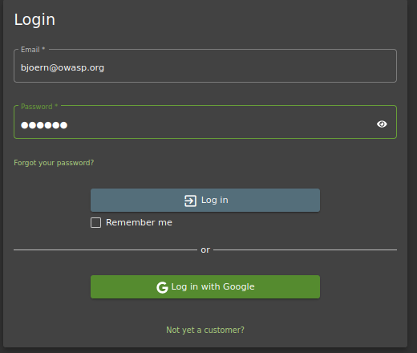

**PRAKTIKUM KEAMANAN JARINGAN**

**“Identification and Authentication Failures”**

**Oleh :**

**Andre Septian Prayogo**

**D4 LJ Teknik Informatika B**

**3122640033**

**POLITEKNIK ELEKTRONIKA NEGERI SURABAYA**

**TAHUN AJARAN**

**2023**

Sebelumnya Identification and Authentication Failures dikenal sebagai
Broken Authentication. Identifikasi dan autentikasi membantu framework
digital sebagai pertahanan awal. Identifikasi melibatkan pengatribusian
identitas unik setiap pengguna untuk menggunakan layanan aplikasi.
Autentikasi memvalidasi sesi pengguna berdasarkan identitas yang
ditetapkan dan kredensial akses. Kegagalan identifikasi dan autentikasi
terjadi ketika aplikasi gagal menerapkan fungsi yang terkait dengan
identitas pengguna, keaslian, dan manajemen sesi dengan benar. Kegagalan
seperti ini sering menyebabkan ancaman tingkat sistem yang terus-menerus
dieksploitasi oleh aktor jahat untuk mengambil identitas pengguna,
pencurian data, atau kompromi seluruh sistem

Pada percobaan satu ini akan mereset password dari akun OWASP Bjoern via
Forgot Password dengan menjawab pertanyaan keamanan yang diberikan oleh
sistem.

1\. Mencari akun dari user Bjoern pada review salah satu produk di Juice
Shop website

2\. Setelah alamat email Bjoern dicopy, pindah ke halaman login, dan
klik Forgot your password pada login page karena tidak tahu apa password
untuk akun ini

3\. Inputkan email bjoern@owasp.org dan akan tampil pertanyaan keamanan
dari akun tersebut yaitu nama hewan favorit nya.

4\. Untuk bisa menemukan nama hewan favorit Bjoern, mencoba mencari di
internet dengan keyword “Bjoern’s favorite pet” dan hasil teratasnya
adalah sebagai berikut.

5\. Setelah diketahui nama hewan favoritnya adalah Zaya, inputkan pada
form lupa password. Ketikkan password baru sesuai keinginan dan klik
change. Di sini saya menggunakan password baru: Bjoern

6\. Setelah klik change, akan tampil notifikasi berhasil menyelesaikan
challenge

7\. Untuk membuktikan berhasil login atau tidak menggunakan password
yang baru, Kembali ke halaman login dan masukkan email dan password yang
baru

