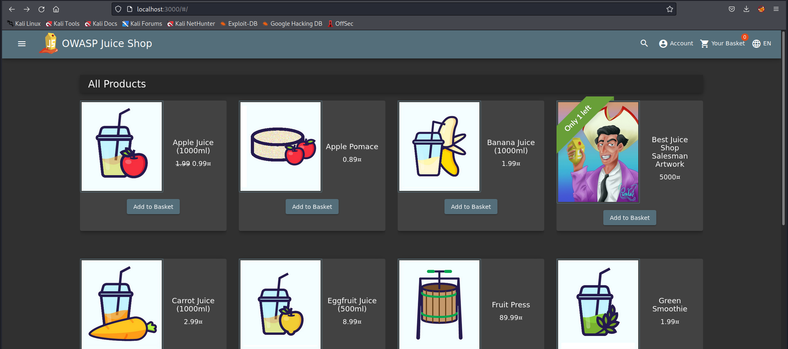
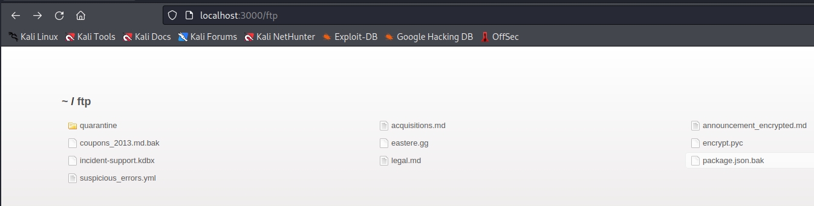
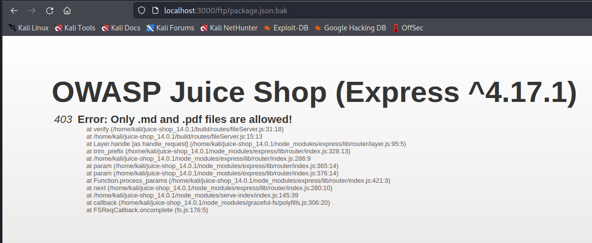
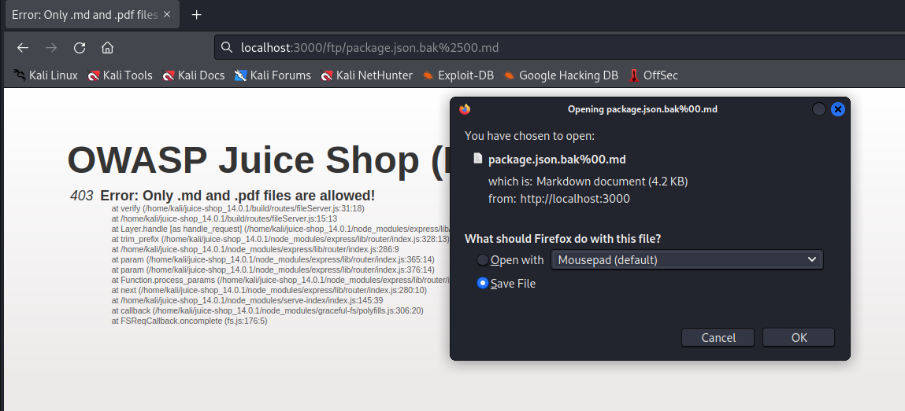
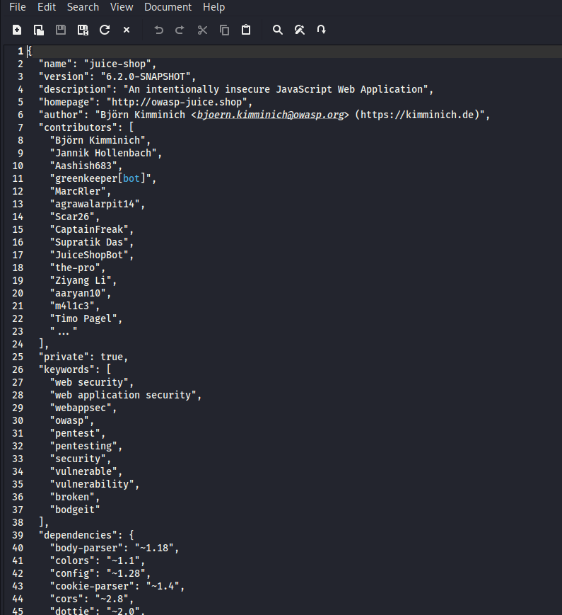

**PRAKTIKUM KEAMANAN JARINGAN**

**“Software and Data Integrity Failures”**

**Oleh :**

**Andre Septian Prayogo**

**D4 LJ Teknik Informatika B**

**3122640033**

**POLITEKNIK ELEKTRONIKA NEGERI SURABAYA**

**TAHUN AJARAN**

**2023**

A08:2021 adalah pendatang baru dan berbicara tentang bahaya yang
terlihat/tidak terlihat yang dibawa oleh perangkat lunak/aplikasi era
modern. Sering disebut sebagai Software and Data Integrity Failures
OWASP, ini berbicara tentang asumsi yang terkait dengan critical CI/CD
pipeline, penanganan data, dan kegagalan integritas pembaruan perangkat
lunak. Dalam bahasa awam, ketika seseorang menggunakan perangkat
lunak/aplikasi/data penting tanpa mengikuti praktik verifikasi atau
autentikasi terbaik, beberapa pendekatan ancaman dan A08:2021 mencakup
semuanya. Tidak melalui proses otentikasi menciptakan peluang bagi
peretas/aktor ancaman untuk mendapatkan akses resmi ke
aplikasi/perangkat lunak yang dibatasi. Setelah itu terjadi, mereka
dibiarkan menyebabkan malapetaka tanpa akhir seperti injeksi kode
berbahaya, pencurian data, dan mengendalikan operasi aplikasi/perangkat
lunaka

**Percobaan**

Pada percobaan ini akan menunjukan mengunduh kode tanpa pemeriksaan
integritas.

1\. Buka aplikasi Juice Shop

2\. Tambahkan /ftp pada URL Juice Shop kita menjadi
<http://localhost:3000/ftp>

3\. Klik package.json.bak, maka akan muncul tampilan sebagai berikut

3\. Setelah itu akana muncul tampilan seperti pada gambar diatas yang
menampilkan error bahwa file tersebut tidak bisa dibuka. Kita ubah
sedikit URL setelah pergi ke halaman package.json.bak menjadi seperti
berikut <http://localhost:3000/ftp/package.json.bak%2500.md>

4\. Setelah menjalankan URL tersebut kita akan mendownload file yang
berisi package json aplikasi website tersebut

Berikut adalah isi dari file package.json yang berhasil terdownload
