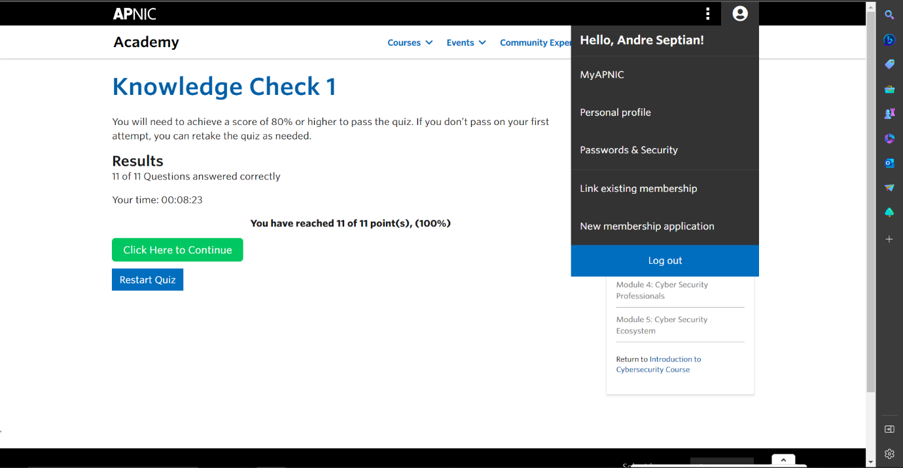

**PRAKTIKUM KEAMANAN JARINGAN**

**“APNIC MODULE 1 SUMMARY DAN PERBANDINGAN WEB SERVER APACHE NGINX
ISS”**

**Oleh :**

**Andre Septian Prayogo**

**D4 LJ Teknik Informatika B**

**3122640033**

**POLITEKNIK ELEKTRONIKA NEGERI SURABAYA**

**TAHUN AJARAN**

**2023**

**APNIC MODULE 1: CYBER SECURITY FUNDAMENTALS**

Internat teridiri dari berbagai sistem dan jaringan yang terpisah.
Jaringan yang terpisah ini dapat berkomunikasi menggunakan protocol umum
yang dapat menemukan bagaimana koneksi yang berbeda dapat saling
bertukar informasi. Tak jarang komunigasi ini dapat menimbulkan berbagai
resiko keamanan.

**DATA DAN INFORMASI**

Pada sebuah perusahaan maupun bisnis, data dan informasi merupakan
sesuatu yang sangat bernilai dan merupakan asset bagi mereka seperti
data laporan internal, data transaksi, informasi pelanggan dan lain
lain. Namun data dan informasi juga memilii berberapa ancaman dari
tindak kejahatan siber seperti munculnya akses yang tidak resmi dan
bahkan kehilangan data, sangat penting untuk mengamankan data dan
informasi bagi suatu perusahaan. Data dan informasi tersebut dapat
diamankan berdasarkan 2 kategori berikut:

**Data at rest**, data ini merupakan data yang tidak aktif melintas pada
jaringan internet seperti data dari database atau data warehouse yang
dilindungi oleh keamanan seperti firewall.

**Data in Motion,** data ini adalah data yang melintas di jaringan
seperti internet dimana data ini sering berpindah dari suatu computer ke
yang lain melalui jaringan internet. Biasanya di simpan di memori
computer atau cloud storage.

Untuk mengamankan kedua kategori diatas diperlukan sebuah kebijaka. CIA
adalah kebijakan standar dalam keamanan informasi yang dirancang untuk
mengatur dan mengevaluasi sebuah organisasi Ketika data disimpan,
dikirim atau diproses, berikut adalah objektif utama dapam keamanan.

**Confidentiality,** data hanya bisa di akses oleh individua tau entitas
tertentu, seperti informasi A hanya boleh di ketahui dan di akses oleh
CEO/CTO.

**Integrity,** adalah metode untuk menjaga agar data atau informasi
tidak dapat dimanipulasi, diubah atau disunting oleh pihak yang tidak
mempunyai kewenangan. Seperti email yang dikirim dan diterima tidak
boleh berubah isinya

**Availability,** data dapat diakses saat dibutuhkan oleh individu yang
resmi. Seperti layanan email harus tersedia 24/7.

**THREAT, VULNERABILITY AND RISK**

Berikut adalah ancaman, kerentnnan dan resiko yang bisa terjadi.

**Threat**, atau ancaman adalah segalanya yang dapat menyerang baik
secara sengaja maupun yang tidak disengaja terdapat 3 kategori,
**Natural threats** seperti bencana alam yang di sebabkan oleh alam,
**Environmental threats**, seperti pencemaran lingkungan, polusi dan
kebocoran gas, dan yang terakhir adalah **Human threats**, seperti aksi
sengaja untuk menyerang sebuah sisatem dan maupun yang tidak disengaja

**Vulnerability**, atau kerentanan dari sistem, desain atau control
internal yang dapat memicu penyerangan oleh individu yang tidak memiliki
akses resmi.

**Risk**, atau resiko seperti potensi kehilangan, kerusakan atau
kehancuran oleh sebuah data atau informasi sebagai hasil dari ancaman.

**KONTROL KEAMANAN INFORMASI**

Perusahaan dapat menanggulangi berbagai ancaman untuk menlindungi
informasinya melalui control keamanan, berikut berberapa kateogrinya:

**Policy and procedures,** dibuat untuk managaement dapat mengarahkan
visi dan misi sehingga kebutuhan bisnis dapat dipertahankan dengan
mengamankan dan menjaga intergritas kebutuhan innformasi sensitive milik
perusahaan. Dan juga bisa berisi tentang prosedur jika mana informasi
dari user bocor maka dapat melaporkan sesuai prosedur yang dibuat.

**Technical**, dibuat untuk mencagah dan mendeteksi potensi penyerangan
dan mitiagasi resiko terhadap penyerangan infrastruktir sistem
informasi,

**Physical**, untuk mencegah akses fisik oleh orang yang tidak berwenang
terhadap data dan informasi serta pencegahan terhadap gangguan
lingkungan sekitar yang dapat membahayakan.

**PRINSIP KEAMANAN INFORMASI**

**Principle of weakes link**, berarti peretas akan mencari jalan
termudah untuk meraih tujuannya.

**Principle of least privilege**, suatu entitas harus bisa mengakses
informasi atau resources yang hanya mereka butuhkan dan dibatasi sesuai
peran atau tanggunga jawab entitas tersebut.

**PERBANDINGAN WEB SERVER APACHE NGINX DAN ISS**

Komunikasi internet id indonseisa berkembang sangat pesat dan telah
mengubah Sebagian besar pola kehidupan bermasyarakat. Meningkatnya
jumlah pengakses layanan internet membuat keberadaan World Wide Web(WWW)
menjadi sangat penting. Oleh karena itu pemberdayaan web server untuk
melayani request berbasis HTTP menjadi sebuah kebutuhan, Apache, NginX
dan ISS merupakan berbarapa contoh dari web server. Ketiganya merupakan
jenis web server yang cukup popular dan sering digunakan di sekala
menengah hingga sekala bisnis, berikut perbandingan ketiga web server
tersebut

**APACHE**

Berikut merupakan kelebihan apache

- Hadir dalam bentuk software lintas operating sistem sehingga dapat
  berfungsi dengan baik pada windows dan linux

- Bersifat open source dan gratis

- Jaringan komunitas besar

- Fleksibel , mendukung kustomisasi koneksi melalui .htaccess

> Berikut kekurangan apache

- Tidak menerima traffic yang tinggi

- Terlalu banyak konfigurasi sehingga keamanan rentan

**NginX**

Berikut merupakan kelebuhan NginX

- Bersifat opensoirce dan gratis

- Kapasitas lebih besar sehingga dapat menangani website dengan traffic
  yang tinggi

- Menggunakan arsitektur sub-process asinkron sehingga request dibuat
  proses baru tidak akan dibuat dimana hal ini dapat meningkatkan
  performa server

> Berikut merupakan kekurangan NginX

- Jaringan komunitas sedikit

- Ekstensi atau modul cukup terbatas

**ISS**

Berikut merupakan keunggulan ISS

- Dukungan komponen protocol DSS,TCP/IP dan software yang dipakai untuk
  membuat aplikasi website

- Mendukung protocol FTP,HTTP,dan SSL

- Mendukung platform.NET

- Mendukung brandwith throttling

- Instalasi mudah karena server ISS adalah core Software

> Berikut merupakan kekurangan ISS

- Hanya dapat diakses pada windows

- Dapat digunakan jika memiliki lisensi windows

- Dibutuhkan resource yang cukup besar

- Keamanan rentan pada port http 80

Hasil dari QUIS

