**PRAKTIKUM KEAMANAN JARINGAN**

**“KNOWLEDGE CHECK MODUL 3&4”**

**Oleh :**

**Andre Septian Prayogo**

**D4 LJ Teknik Informatika B**

**3122640033**

**POLITEKNIK ELEKTRONIKA NEGERI SURABAYA**

**TAHUN AJARAN**

**2023**

**MODUL 3**

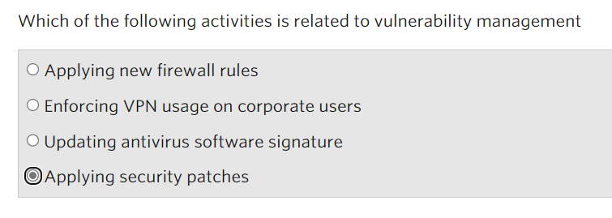Vulnerability
management is a cyclical practice that aims to identify, classify,
remedy and mitigate vulnerabilities. Images of patches or updates in a
timely manner are some of the examples. By applying security patch can
increase security and minimum the risk.

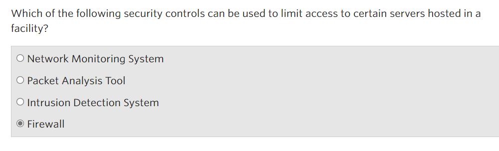

Firewalls prevent unauthorized access to a computer/server or network.
Usually a firewall is installed on the boundary between two networks.
They can be hardware or software running on a computer that acts as a
gateway.

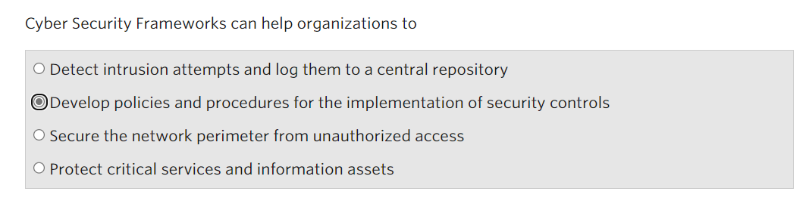

The Cyber Security Framework or security standard is a set of process
documentation used to define policies and procedures around the
implementation and ongoing management of security controls in an
enterprise environment. With Cyber Security framework organization can
improve their security and make their activities more eficient

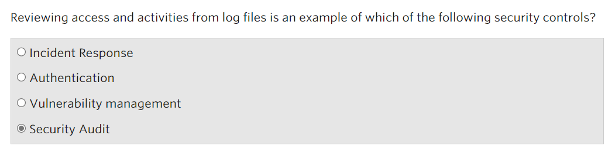

Security Audit is a measurable technical assessment of a system or
application. Assessment can be through interviews, security
vulnerability scans, and analyzing physical access to the system.

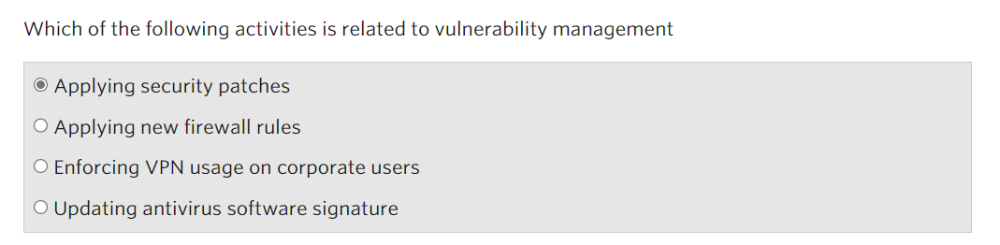

Vulnerability management is a cyclical practice that aims to identify,
classify, remedy and mitigate vulnerabilities. Images of patches or
updates in a timely manner are some of the examples.

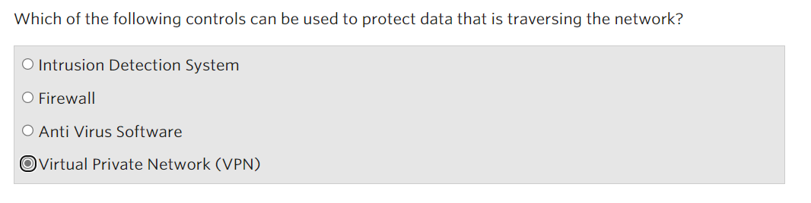

Virtual Private Network (VPN) is a secure and encrypted connection that
provides a secure tunnel for data across the network. VPNs are generally
used to protect data crossing a network by creating a secure connection
between two endpoints. When data is sent over the internet, it passes
through various networks and routers that may not be trusted. Hackers
can intercept this data and steal this sensitive information. However,
when data is sent through a VPN, it is encrypted and travels through a
secure tunnel this makes difficult for hacker to intercept and steal
data from it.

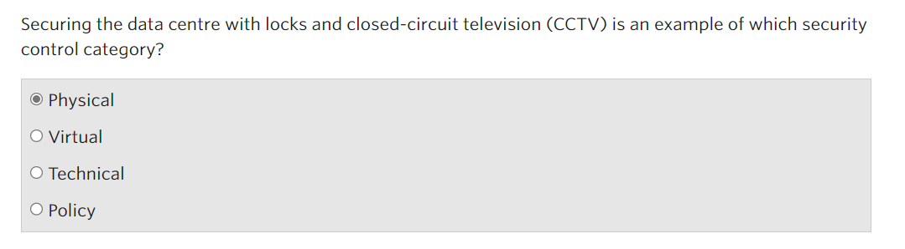

CCTV include security control in physical category because it monitor
physical activities of the action of human being itself.

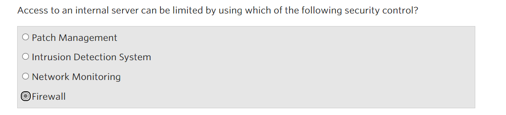

To limit access we can use a firewall because firewall can prevent
unautohirized access to a computer/server or network.

**MODUL 4**

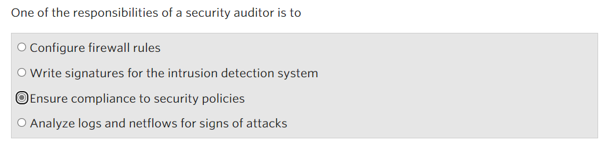

Security Auditors are responsible for ensuring that security plans and
controls are properly implemented. They assist in identifying practices
that do not comply with existing policies or standards. In addition,
they will discuss improvement opportunities with relevant stakeholders

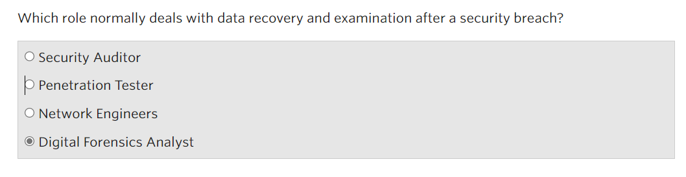

Recovering and examining data from computers and other electronic
storage devices for use as evidence data in criminal investigations or
prosecutions is the job of a Digital Forensics Analyst

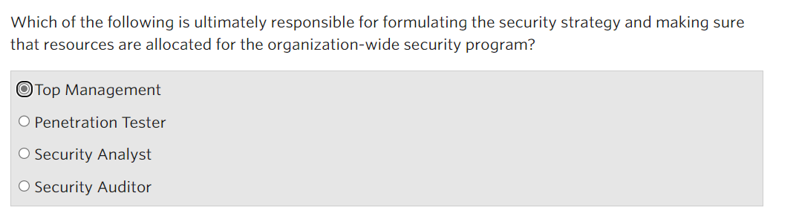

The chief executive officer (CEO) and top management of an organization
have a major role in the overall security of the deployment. CEO and top
management ensure a security strategy is in place, and adequate
resources are allocated to security and the organization's cyber defense
capabilities.

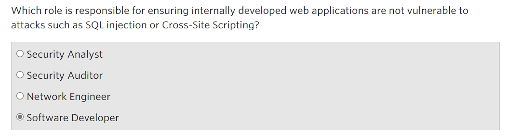

Software Developer is responsible for writing and coding individual
programs or providing entirely new software resources based on needs.
From a security perspective, there is a need to understand or have an
appreciation of secure coding. If the website is vulnerable to SQL
Injection or Cross-Site Scripting, the website is not secure coding.

I will explain how SQL injection is bad and why Software developer role
is who have responsibilities for that. Im going to use owasp for the
example

In SQL query we usually using this SQL code to validation login

SELECT \* FROM user WHERE username = ‘text’ AND Password=’text’

In OWASP we know the username for admin in item description but we don’t
know the password

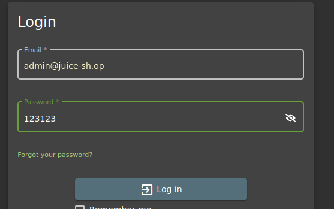

In that case the SQL Query wil be following

SELECT \* FROM user WHERE username = ‘admin@juice-sh.op’ AND
Password=’123132’

In this case we cant login because the password is inccoret, but what if
we change the SQL Query? By using special character (-- ) two dashes
with space is equal to comment in SQL

So in the SQL querry instead of

SELECT \* FROM user WHERE username = ‘admin@juice-sh.op’ AND
Password=’123132’

We will change and give special character like this

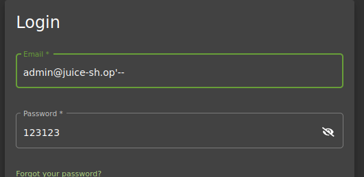

Appling ‘—will make SQL querry ignore the rest of code after admin
checking

SELECT \* FROM user WHERE username = ‘admin@juice-sh.op’-- “AND
Password=’123132’

So the character in the comment telling it to ignore the rest of the
code, so now the statement is simply, if username is
<admin@juice-shop.op> so we can login without password checking

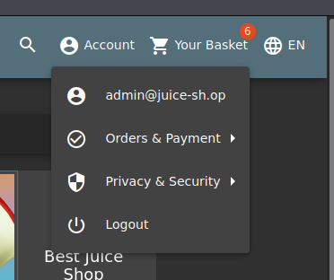

So in this case software developer must know and must aware for this
kind of weaknes.
