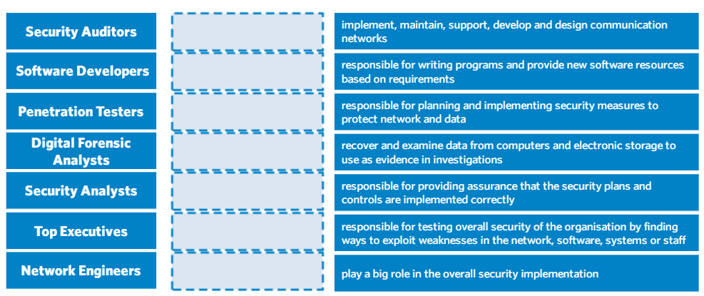

**PRAKTIKUM KEAMANAN JARINGAN**

**“Essay Profesi**

**Oleh :**

**Andre Septian Prayogo**

**D4 LJ Teknik Informatika B**

**3122640033**

**POLITEKNIK ELEKTRONIKA NEGERI SURABAYA**

**TAHUN AJARAN**

**2023**

Dari list role yang ada diatas, ketika kerja nanti role apa yang ingin
anda isi dan pada role tersebut anda ingin menjadi apa?

pada role diatas, untuk saat ini saya profesi yang cocok untuk saya
adalah sebagai Software Developer. Pada role ini saya ingin menjadi
Android Developer.. Alasan saya memilih role Software Developer sebagai
Android Developer dikarenakan untuk saat ini kemampuan yang saya kuasai
masih seputar Software Developer saja. Tetapi saya tetap tertarik untuk
mengetahui lebih banyak lagi role-role IT yang ada pada perusahaan,
supaya saya dapat mengetahui dan memahami semua proses bisnis yang ada
pada perusahaan IT. Hal tersebut saya lakukan supaya suatu saat saya
dapat mengimplementasikan pada perusahaan saya sendiri.
