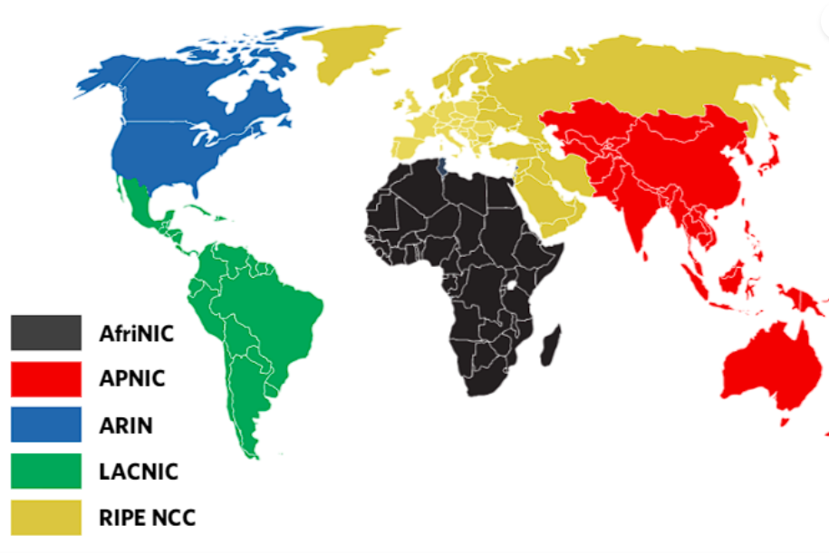

**PRAKTIKUM KEAMANAN JARINGAN**

**Cyber Security Ecosystem**

**Oleh :**

**Andre Septian Prayogo**

**D4 LJ Teknik Informatika B**

**3122640033**

**POLITEKNIK ELEKTRONIKA NEGERI SURABAYA**

**TAHUN AJARAN**

**2023**

Pada modul 5 ini membahas tentang Cyber Security Ecosystem. Pada modul
ini nantinya kita akan memahami entitas dalam ekosistem keamanan siber,
serta peran dan tanggung jawab mereka dan juga mengetahui spesialis mana
yang diperlukan untuk menyelidiki insiden pelanggaran keamanan.

**Government**

Banyak pemerintah telah membentuk badan cyber security atau Computer
Emergency Response Teams (CERT) nasional untuk koordinasi yang lebih
baik. Berikut adalah Natinoal Security Strategy yang akan di terapkan:

1\. Melindungi system informasi pemerintah dan infrastruktur kritis

2\. Meningkatkan ketahanan dan kesiapsiagaan dalam menghadapi serangan
siber

3\. Meninjau atau mengembangkan kebijakan dan undang-undang yang relevan

4\. Meningkatkan kesadaran keamanan di kalangan warga

**Network Operators**

Operator jaringan memperoleh alamat IP dan nomor AS dari Registries
Internet Regional (seperti APNIC). Mereka menyediakan infrastruktur
penting yang memungkinkan pengguna terhubung ke Internet dengan
merutekan paket dan mengumumkan rute ke jaringan lain.

Kepentingan utama: memastikan ketersediaan dan stabilitas jaringan yang
tinggi kepada pelanggan mereka. Umumnya, mereka memiliki kebijakan untuk
mencegah penggunanya melakukan penyalahgunaan jaringan. Mereka juga
menyediakan titik kontak melalui database whois untuk melaporkan
penyalahgunaan atau insiden keamanan. Di beberapa negara, mereka bekerja
sama dengan CERT Nasional dalam menangani insiden keamanan.

**Law Enforcement Agencies (LEAs)**

Lembaga Penegak Hukum adalah organisasi yang bertanggung jawab atas
penegakan hukum. Di beberapa negara, mereka bisa menjadi badan
kepolisian nasional dan badan terkait lainnya. Melalui investigasi dan
penuntutan tindakan kriminal, mereka melindungi Internet agar tidak
menjadi korban kejahatan dunia maya dan kejahatan yang dimungkinkan oleh
dunia maya. Karena sifat global Internet, kolaborasi dengan LEA dan
pemangku kepentingan lainnya sangat penting untuk menyelesaikan
kejahatan dunia maya dan kasus kriminal yang dimungkinkan oleh dunia
maya. Organisasi Polisi Kriminal Internasional (INTERPOL) dan EUROPOL
sangat aktif mengembangkan kemampuan cyber LEA.

**CERTs of CSIRTs**

Computer Emergency Response Teams (CERT) atau Computer Security Incident
Response Teams (CSIRT) adalah organisasi yang menyediakan layanan
tanggap insiden. National CERTs: Biasanya memiliki fungsi koordinasi dan
bekerja dengan entitas yang berbeda untuk mendeteksi dan menanggapi
insiden keamanan. Mereka mungkin juga memiliki konstituen yang lebih
besar. Enterprise-level CERTs or CSIRTs: CERT atau CSIRT tingkat
perusahaan menyediakan layanan penanganan dan respons insiden untuk
organisasi induk dan pelanggan (seperti CSIRT Bank atau ISP)
Regional-lever CERTs or CSIRTs: CERT dan CSIRT tingkat regional, seperti
APCERT dan TF-CSIRT, memfasilitasi kerja sama antara CERT dan CSIRT
individu di wilayah mereka.

**Reginal Internet Registries (RIRs)**

Regional Internet Registries (RIR) adalah organisasi yang mengelola
alokasi dan registrasi sumber daya nomor Internet dalam wilayah tertentu
di dunia.

Setiap RIR mengelola sebuah registri (database whois) yang berisi
informasi tentang organisasi yang memiliki alamat IP dan nomor AS.

**Domain Name Registrars**

Pencatat nama domain harus diakreditasi oleh generic top-level domail
(gTLD) dan/atau registri country code top-level domain (ccTLD). Domain
Name Resgistry: Database atau semua domain dan informasi pendaftar
terkait. Whois Lookup: Dapat dilakukan pada database untuk mengetahui
pemilik atau pendaftar domain yang terdaftar. Ini juga dapat berguna
untuk melaporkan atau menyelidiki insiden keamanan.
